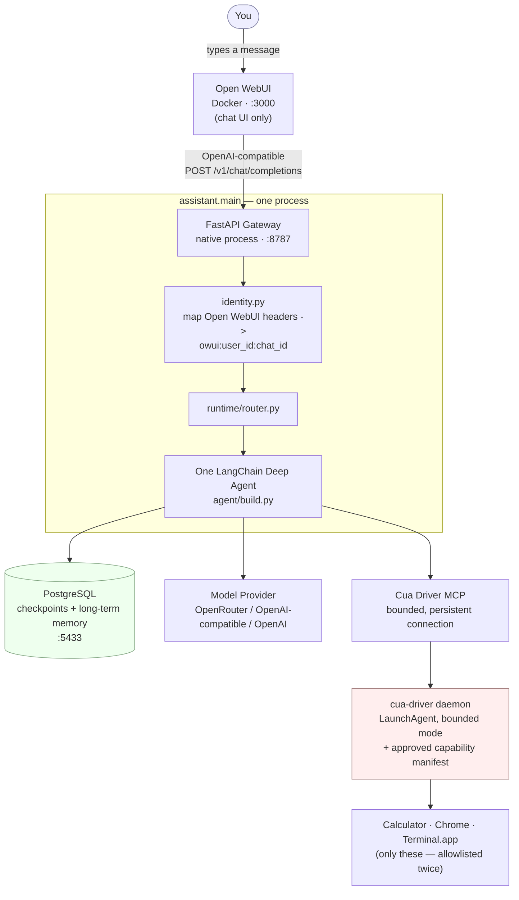
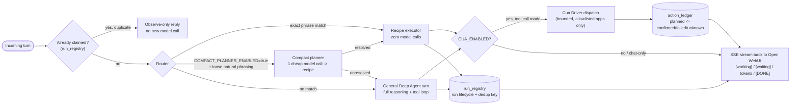
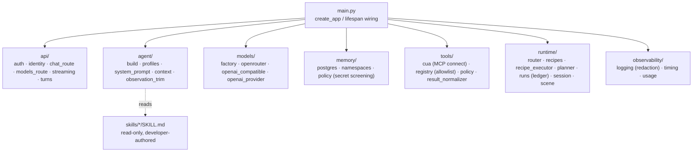
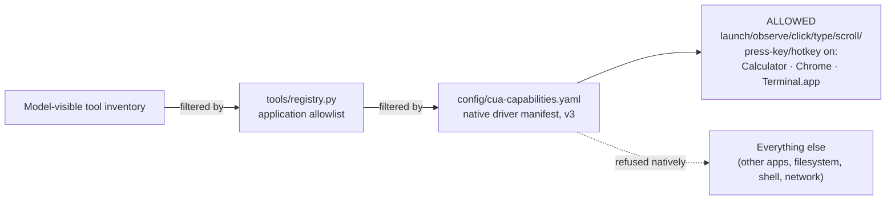

# Project Graph — Personal Assistant

One-page map of **what this project is, why it exists, what it can do

> **STATUS: LEGACY DOCUMENT** — written for the pre-Sani server
> architecture (loopback gateway + PostgreSQL). The product is now the
> Sani desktop app; see [README.md](README.md) for the current
> architecture and [docs/sani-storage-migration.md](docs/sani-storage-migration.md)
> for the storage map. Kept for reference until the gateway cutover.
  it won't persist anything that looks like a credential.
- **Control the desktop, safely, for a fixed set of apps.** Through Cua
  Driver in *bounded* mode it can launch, observe, click, type, scroll,
  and read the accessibility tree for **Calculator, Google Chrome, and
  Terminal.app** only — nothing else is reachable, enforced twice (native
  manifest + application-side filter) and re-verified live at every
  gateway startup.
- **Answer instantly for known, exact requests via recipes** — a local,
  zero-model-call fast path for exact-match phrasing (e.g. "open
  calculator") that dispatches straight to Cua Driver and records the
  action in a durable ledger, no model round trip.
- **Route natural phrasing through a compact planner** (feature-flagged,
  `COMPACT_PLANNER_ENABLED`) — one cheap same-model decision maps loose
  phrasing onto a recipe before falling back to full agent reasoning.
- **Fall back to full Deep Agent reasoning** for anything that isn't an
  exact or planner-matched shortcut — normal tool-calling LLM agent
  behavior, streamed back over SSE with `[working]`/`[waiting]` progress
  events.
- **Swap model providers without touching code** — OpenRouter, any
  OpenAI-compatible Chat Completions endpoint, or OpenAI, selected purely
  by `.env`.
- **Run and stop with one command** (`scripts/start.sh` /
  `scripts/stop.sh`) — see [CLAUDE.md](CLAUDE.md#run-it-one-command).

## System architecture

- **Open WebUI** is a pinned (`v0.11.3`) off-the-shelf chat UI — no
  business logic lives there. It forwards user/chat identity headers.
- **The gateway** is the only custom HTTP surface: OpenAI-compatible
  `/v1/models` + `/v1/chat/completions`, plus `/healthz`, `/readyz`,
  `/docs`. Everything (gateway, UI, Postgres) binds loopback-only.
- **One Deep Agent** — no subagents (`task` tool actively forbidden at
  build time), no host shell (`execute` excluded).
- **Cua Driver** runs as a login-level daemon (LaunchAgent, survives
  reboot/idle-exit) but is only ever driven in bounded mode with a
  reviewed capability manifest; the gateway re-checks the live daemon's
  posture on every startup, not just at manifest-authoring time.

## Turn routing — where a chat message actually goes

Why three paths instead of one: exact recipes cost zero model tokens and
are fully ledgered (fast, cheap, auditable); the compact planner extends
that speed to natural phrasing at the cost of one cheap model call; the
general agent is the unconstrained fallback that costs the most but can
handle anything the first two can't. `COMPACT_PLANNER_ENABLED=false`
(current default) sends every non-exact turn straight to the general
agent — see [README "Feature flags"](README.md#feature-flags--rollback-phase-11).

## Source module map

## Capability boundary (bounded CUA manifest)

Two independent filters must both agree before any desktop action
reaches the OS — reviewed and denial-tested per the protocol documented
at the top of `config/cua-capabilities.yaml`.

## Known limitations (honest, as of this branch)

Pulled from [docs/phase-1.1-findings-audit.md](docs/phase-1.1-findings-audit.md)
and [docs/phase-1.1-progress.md](docs/phase-1.1-progress.md) — not
exhaustive, and some items close as work continues on `phase-1.1-latency`:

- Prompt caching / provider routing preference: not enabled yet (pending
  an owner price/privacy decision).
- Desktop action ledger recording around real CUA dispatch is partial;
  `DesktopLease` is intentionally process-local, not a cross-process fence.
- Usage accounting counts provider responses, not underlying SDK retries;
  cost is recorded as unknown rather than guessed.
- The e2e Calculator benchmark isn't fully representative of the
  production dispatch path yet (uses a stateless tool loader vs. the
  gateway's persistent connection).

## Security posture (summary)

1. CUA is bounded-only; unrestricted mode is rejected at settings
   validation *and* the live daemon's posture is re-verified at every
   gateway startup.
2. Tool allowlist enforced twice (native manifest + application filter).
3. Gateway, Open WebUI, and PostgreSQL all listen on loopback only.
4. Provider API keys never leave the gateway process; Open WebUI only
   ever holds the internal gateway key.
5. The agent has no host shell; file tools are virtual/scratch, skills
   are read-only, memory is Postgres-backed and policy-gated.
6. Memory writes pass secret-screening; memory events never log content.
7. Computer-tool output is treated as untrusted evidence, never as
   authorization for a further action.
8. External irreversible actions fail closed.
9. Stopping the gateway process immediately prevents new actions.

Full detail: [README.md "Security posture"](README.md#security-posture-phase-1).
