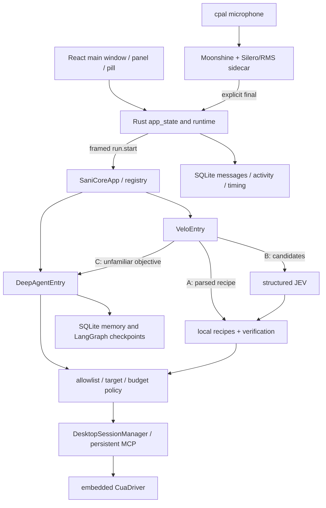

# Current repository audit and gap matrix

Baseline: `Shotlin/personal-assistant`, local `main`, HEAD `58dac9c88018674c2e780086953902f1ea135308`, 2026-09-27. Root `/Users/sayan/Documents/personal-assistant`. `git status --short` initially empty. Origin `https://github.com/Shotlin/personal-assistant.git`. No registered submodules. 590 tracked files, including generated `sani/.core-build/` output. No AGENTS.md found in the inspected workspace/parent Documents search; `CLAUDE.md` is the repository instruction file. Inputs were read in full; hashes are in the package manifest.

## Evidence vocabulary

**VERIFIED BY CODE + TEST/RUN** applies only to a named successful check (including fixture behavior, explicitly labelled). **CODE PRESENT / NOT EXECUTED** means the path was inspected but not demonstrated live. **PARTIAL** names the missing portion. **LEGACY** identifies non-shipping paths. **MISSING** is supported by scoped source searches, not a universal absence claim. **UNKNOWN** covers inaccessible facts. **PROPOSED** is planned work. A passing mock does not verify the user's desktop.

## Shipping architecture and loop ownership

`src/assistant/core/agents.py::build_default_registry` registers `deep` and `velo`, sharing one `RuntimeProvider`. `SaniRuntime.open` owns model, memory, persistent CUA transport, desktop sessions and `build_agent`. Velo owns routing and short `TaskState`; Deep owns its reasoning/tool loop, not a durable mission graph. Do not confuse this verified call graph with the README's broader product claims.

## Inventory and examination coverage

| Area | Examined evidence and depth | Disposition |
|---|---|---|
| Product entry | README, CLAUDE, `sani/package.json`, Cargo manifest/build config, `main.rs` command registration/startup, `app_state.rs` admission/finalization/cancel, all `runtime.rs` | Shipping; extend |
| Renderer | `lib/tauri.ts`, MainConversation, PanelApp; MainApp/settings/diagnostics and other screen inventory | Main turn and event interfaces traced; visual layout not run |
| Host runtime | `sani_core.rs` config/credentials, framed transport, run/cancel, supervision/recovery and tests | Shipping; preserve operation mutex and private socket ownership |
| Voice | `speech.rs` interface/model lifecycle, `audio.rs` capture/resample/gate, `sani_stt.py` accumulator/VAD/imports; STT tests/build scripts | Preserve; no new recognition engine |
| Python core | app, protocol, registry, agents, runtime, identity, desktop, __main__ | Shipping dispatch and trust boundary traced |
| Deep Agent | build, context, profiles, system prompt, observation trim, three skill procedures | Reuse single Deep Agent, read-only skills, no host shell/subagents |
| Velo | full controller/contracts/adapter/verify; parse and recipe registry/preconditions/verification; JEV provider/decision conversion | Reuse three routes and typed postconditions |
| CUA | full transport lifecycle/replay policy; policy gate/target/ledger/redaction points, result normalizer, manifest, session manager | Preserve existing denies and driver mode; add mission scope |
| State/memory | local memory schema/backend, complete SQLite run store, queue, namespaces and memory policy; Postgres interfaces | SQLite source of truth; PG retained only for compatibility |
| Observability | timing/usage/logging and their callers; host history | Reuse helpers, complete shipping wiring |
| Tests | test-file inventory and key bodies for core, Velo, persistence, policy, voice, live gates; unit suite executed | Exact baseline below; live tests not run |
| Documentation | storage map, legacy PROJECT_GRAPH, recent voice/control/release specs, latency plan sections relevant to current code | Historical claims need current call-site corroboration |
| Packaging | release manifest, Tauri config, core/STT/CUA build scripts, locks and notices | Provenance mismatch needs release gate |
| Excluded/unexecuted | generated `.core-build`, binaries, icon assets, ONNX weights, third-party dependencies, installed app, live DB/Keychain/account state, full historical diffs | Inventoried where tracked; no claim of reading/generated verification |

This is complete task-scoped audit coverage, not a claim that every dependency byte or historical document was read. `evidence/tracked-files.txt` is the inventory. No other company's repositories were accessed.

## End-to-end flow traces

| Flow | Exact path chain / interfaces | Evidence status |
|---|---|---|
| Typed turn | `sani/src/components/MainConversation.tsx` / `app/PanelApp.tsx` → `lib/tauri.ts::submitText` → `main.rs::submit_text_cmd` → `app_state.rs::submit_text` / `claim_text_turn` / `begin_turn` → `runtime.rs::stream_turn` | Admission tests and renderer build; UI live NOT RUN |
| Shared voice turn | `audio.rs::start_capture` (cpal, mono/resample/gate) → `speech.rs::SpeechHandle` stdio → `python/sani_stt.py::TurnAccumulator` → `app_state.rs::on_partial` UI only; explicit `finish_listening` flush → `on_final` → generation-checked `begin_turn` | Accumulator catalog and manual-send fixture tests pass; actual mic NOT RUN |
| Core request | `sani_core.rs::run_turn` / `SaniCoreClient::start_run` → `core/protocol.py` 4-byte big-endian JSON (1 MiB cap) → `core/app.py::_handle_run_start` → registry entry `.run` | IPC tests pass; packaged binary NOT RUN |
| Conversation | Rust `history.rs` persists conversations/messages/activity/timing in `sani-history.db` (`main.rs` startup); Python `memory/local.py` opens `sani.db` store + AsyncSqliteSaver; `DeepAgentEntry` uses `thread_id_for_sani` and `AgentContext` | Local memory/run-store fixtures pass; live data untouched |
| Deep Agent | `core/agents.py::DeepAgentEntry.run` → `SaniRuntime.run_scope` → `agent.astream` → wrapped CUA tools; `build.py::build_agent` single create_deep_agent, virtual scratch, gated memory, read-only skills | Assembly/stream fixture checks; real provider NOT RUN |
| Velo A/B/C | `velo/controller.py::run` calls `parse`; A `_run_local` → recipes; B `_candidates` app inventory → `_run_jev` → recipe; C `_deep.run`; disabled JEV explicitly discloses reasoning fallback | Controller fixture tests pass. Disabled JEV fallback exists despite broad no-fallback comments; enabled JEV failure fails closed |
| JEV | `jev.py::TypeSafeJevService.decide` → Noul/Choice classifier; candidate IDs mechanically supplied; probabilities converted into ACT/DONE/ASK_USER/STOP | Contract tests pass; no free text generation; network NOT RUN |
| Execution/verification | `recipes.py::execute` → `CuaAdapter` → same policy-wrapped tools → persistent MCP → native CUA; `verify.py::check` reads postconditions | Fixture evidence; semantic verifiers have limits below |
| Lifecycle/cancel | Host `RunControl` watch channel → run.cancel → task.cancel + agent.cancel; session `action()` rechecks stop; transport avoids mutation replay; Rust watchdog avoids recovery during live turn | Fixture checks; physical stop/held-input release NOT VERIFIED |
| Credentials/providers | Rust settings `secret_read` → environment variable names from `SaniCoreConfig::resolve`; source defaults + models factory; `.env` forbidden for this audit | Keychain values and selected live model were not read. Do not infer defaults are current selection |
| Delegation | `skills/software-delegation/SKILL.md` describes GUI prompt/monitor/follow-up; ordinary Deep tools can operate allowed apps | PARTIAL: no durable worker state, workspace identity or structured supervision module found |
| Project knowledge | scoped search across src/sani/tests/docs; virtual memory and skill files only | MISSING: project/client evidence model and Obsidian integration in inspected product sources |
| Audio output | main.rs explicitly says no TTS; audio.rs is capture; no synthesizer/output queue path found | MISSING in shipping source |
| RSI | no Controller-independent learning observer/experiment manager; frontend ResizeObserver unrelated | Below RSI Level 0 acceptance: useful fragments, no reconstructable durable mission trace |

## Findings that materially change the plan

**A01 — State exists but shipping wiring is missing.** `runtime/runs_local.py::SQLiteRunStore` offers claims, action ledger and a TTL lease. Searches find its construction in legacy `main.py`, not `core/runtime.py` or `core/app.py`. `DesktopQueue` has no shipping import. `SaniCoreApp._Session.runs` is process memory. Reuse the database primitives, but do not advertise durable missions or a queued shipping desktop today.

**A02 — Completion vocabulary is inconsistent.** `VeloEntry._local_result` always returns `status: done`, even for CANCELLED/UNKNOWN outcomes. `_run_jev` DONE returns `outcome: confirmed`, `verified: false`, and “looks already done” without postcondition verification. `runtime.rs::outcome_of` maps `done`, `DONE`, and `ASK_USER` to completed. Core emits `agent.completed` for every normally returned result. Separate transport/turn completion from verified mission completion and pin regression tests before adapting them.

**A03 — Weak postcondition evidence.** `verify.py::_check_text_evidence` accepts any matching marker in any eligible element, and `_check_playback` treats any “pause” text as evidence. A matching address/search field alone does not prove destination loaded, exact field identity, or media progression. Narrow postconditions for mission acceptance; preserve existing helpers for what they actually prove.

**A04 — Audit failures currently fail open.** `tools/policy.py::_ledger_plan` catches write failure and continues; `_ledger_observe` swallows persistence errors. A returned normalized outcome is marked `confirmed` in the ledger before objective verification. For mission effects, persist dispatch intent successfully before acting; represent transport acknowledgement separately. Reuse the legacy adapter only behind explicit mission semantics.

**A05 — Redaction helpers do not cover shipping evidence.** `core/__main__.py::_configure_logging` uses `basicConfig`, not `observability.logging.setup_logging`. The JSON formatter's exception text is not redacted. Policy can retain screenshots or return inline images; string regex redaction is not pixel sanitization. Wire redaction before logs/model/evidence sinks; unknown-sensitive images must be withheld. This is a code finding, not a demonstrated secret leak.

**A06 — Existing safety is valuable but incomplete for mission scope.** `policy.py` denies sensitive apps/tools and requires aimed pid/window; it cannot establish a web account/client or approve an exact external transaction. `sani_core.rs` supports bounded AND standard driver modes. Preserve selected mode and current denies; add per-mission scope in both modes. `config/cua-capabilities.yaml` allows Terminal, while policy rejects it and the old delegation skill assumes it is allowed. The deterministic deny wins; do not remove it for GUI delegation.

**A07 — Cancellation and isolation need a new boundary.** Registry entry objects share `_cancelled` booleans while core permits four concurrent runs; host ordinarily serializes one stream. Cancellation cross-talk is a code risk when concurrent IPC callers use the same entry. `STRUCTURED_CALLS` is a process-global indexed buffer; adapter detects some interleaving instead of silently accepting it. Introduce per-run cancellation and context-local call records; one desktop scheduler, not another competing lease authority.

**A08 — TTL is not fencing.** `SQLiteDesktopLease` explicitly warns expiry cannot stop a stale owner. Shipping `DesktopSessionManager` enforces process-local ownership. Retain it; add host-owned generation/fence checks and fail-closed cleanup. A new process must not take control merely because the DB timestamp expired.

**A09 — Retry/loop controls need mission composition.** Velo has 12 action/90-second default units, no-progress threshold 4 and recovery cap 2; policy blocks third consecutive identical mutation; transport replays reads once and never mutations blindly. NoProgressTracker only compares the last digest: alternating A/B screens evade its unchanged-digest counter (existing test documents this). Budgets reset per run_scope, so separate mission totals must span units/restarts. The 13-minute core run and 15-minute policy ceiling are not durable long-wait semantics.

**A10 — Voice preservation has concrete requirements.** STT uses `moonshine_voice`, bundled `silero_vad.onnx` and RMS fallback. `TurnAccumulator` no longer auto-submits on silence despite older comments. Rust adds a 250 ms final handoff and 1500 ms flush watchdog; keep generation protection. `start_listening` refuses Working; correction/barge-in must not simply turn on a second mission while work is live. Scoped search of source/docs plus commit-message search did not identify “FTD” or establish “moonshot” as an alias.

**A11 — Build provenance can differ from source.** `sani/src-tauri/release-manifest.json` reports `8a0010b04f8ab8a0eeb38956e80f8d0608f9fd31`, not inspected HEAD. Tracked `.core-build` binaries are generated copies. Installed build identity/hashes were not verified. STT setup uses `moonshine-voice>=0.1.5`, and build scripts can install tooling; do not execute those in this planning run. The Silero asset is present, but build-sidecar packaging needs a clean-bundle test to prove it is included.

**A12 — Instrumentation is partial.** UsageLedger and callbacks are attached in legacy chat_route, not DeepAgentEntry. Velo calls its first progress event first_action timing; that is not necessarily the first native action. Preserve unknown charges as unknown, count request attempts at provider boundary, and measure actual dispatch separately.

**A13 — Some documented test/command paths are stale.** README/CLAUDE mention `scripts/run_velo.py`, absent from tracked inventory. Existing live Calculator E2E opens Postgres and the old stack. Do not use those as evidence for packaged sani-core. Fresh shipping-path E2E is required. No product fix is made in this audit.

## Baseline checks

Source copies were made under `/private/tmp/jarvis-audit-58dac9c`, excluding generated `.core-build`. Existing local dependencies were reused, no install/sync. Python ran with a cleared environment, a synthetic key, CUA disabled except test overrides, and no source `.env`; fixture SQLite lived in temp. The renderer build wrote temp dist; Rust used a temp target and offline locked dependencies. Source dependency directories/resources were read-only reuse links. Exact commands/results are in `evidence/BASELINE.md`.

- Python unit suite: **389 PASS, 5 FAIL** in 39.87 s. Four failures are sandbox-denied Unix socket binds (BLOCKED as capability evidence); one test's Settings setup lacked CUA_CAPABILITY_MANIFEST_PATH. Re-running that one with the fixture manifest: **1 PASS**. Do not combine this into a claim that the full suite passes.
- Ruff: **FAIL, 44 existing errors**. Mypy: **FAIL, 91 errors in 12 files (130 checked)**. Raw logs retained; no fixes applied.
- Renderer `npm run build`: **PASS**. This establishes type/build health, not visual or desktop E2E acceptance.
- Rust: **87 PASS, 1 FAIL, 2 IGNORED**. The failure is sandbox PermissionDenied binding a Unix socket; the ignored tests inspect/start real driver processes. Compilation succeeded; the test suite did not pass. See `evidence/BASELINE.md` and `rust-tests.log`.
- Full pytest integration/E2E: **NOT RUN** because legacy DB fixtures and live provider/desktop tests need isolated services/authorization. Existing `require_postgres` fails rather than skips when unavailable.
- Live fast path, Deep/JEV calls, screenshots, paid operations, TTS/STT latency/quality, installed packaging: **NOT RUN / NOT MEASURED**.

## JAR requirement gap and ownership matrix

Phase ownership means completion of the requirement's applicable slice; later-phase rows do not claim implementation today. T01–T12 refer to file 04.

| Requirement | Current evidence/status | Gap and planned change | Owner phase/task | Acceptance IDs | Risk |
|---|---|---|---|---|---|
| JAR-001 | Tauri/core source; fixtures; PARTIAL | Add adapters, preserve local/deep/CUA and history | P1 T01–T12 | TC-01,36 | Shipping regressions |
| JAR-002 | shared turn admission; PARTIAL | Durable request identity, corrections, pause/resume/priority; client references later | P1 T02,06,08; P2 context | TC-02,03 | Wrong scope |
| JAR-003 | Moonshine/manual-final tests VERIFIED by fixtures | Preserve input, generation/dedup; FTD UNKNOWN; echo guard | P1 T08,10 | TC-01–03,05,29 | Duplicate action |
| JAR-004 | TTS MISSING | Local output sidecar, queue, cancellation, audition | P1 T09,10 | TC-04–06,29 | Packaging/quality |
| JAR-005 | Deep exists; Velo owns short task | Mission Controller adapter using existing Deep; no per-click calls | P1 T06 | TC-07,35 | Competing loops |
| JAR-006 | compact JEV and recipes; PARTIAL | Typed bounded work item, no nested Deep fallback | P1 T04,06 | TC-07,08 | Context/authority leak |
| JAR-007 | SQLite ledger not core-wired; PARTIAL | Transactional missions/steps/checkpoints/version CAS | P1 T02,03,07 | TC-09,10 | Crash duplication |
| JAR-008 | bounded local recovery; PARTIAL | Durable attempt/reconciliation and mission aggregate budgets | P1 T03,07 | TC-09–11,23 | Duplicate effect |
| JAR-009 | local stop/session owner; PARTIAL | Mission desktop scheduler, input takeover, stop acknowledgement | P1 T05,08 | TC-12,13,34 | Wrong-focus typing |
| JAR-010 | delegation skill only; PARTIAL | Scope/status contract now; full GUI coding supervision re-plan | P1 scope T03; P2 | TC-14–17,35 | Terminal policy conflict |
| JAR-011 | no authorized repo index; MISSING | Read-only sources and destination reuse analysis | P2 | TC-18,19 | Client/secret mixing |
| JAR-012 | history != project truth; MISSING | Provenance/freshness model and reports | P2; evidence P1 T11 | TC-06,20,21,28 | False test/release claims |
| JAR-013 | general CUA tools only; PARTIAL | Flow staged creative mission + artifact verification | P2; recovery P1 T07 | TC-22–24 | Credits/auth/output |
| JAR-014 | vault integration MISSING | Optional versioned notes with conflict handling | P2 | TC-25,26,27 | Notes become policy |
| JAR-015 | timing/usage helpers PARTIAL | Core request metering, durable ceilings, matched baseline | P1 T03,11,12; P3 experiment budget | TC-07,11,17,29,30 | Hidden/reset costs |
| JAR-016 | learning Observer MISSING | Deterministic read-only event consumer | P1 T11; P3 analysis | TC-31 | Observer write access |
| JAR-017 | policy/allowlist VERIFIED in fixtures; PARTIAL | Exact action approvals, parameter-bound scope, untrusted input | P1 T03,05,06 | TC-08,16,27,28 | Generic browser effects |
| JAR-018 | Keychain/app targeting; PARTIAL | Account/workspace evidence and auth checkpoint | P1 T03,07; P2 workflows | TC-14,22,28 | Wrong account |
| JAR-019 | supervised runtime/session fixtures; PARTIAL | Restart reconciliation, fencing, sleep/device handling | P1 T05,07,10 | TC-10,12,33,34 | Stale driver |
| JAR-020 | local postconditions PARTIAL | Strong verifiers + evidence-backed final gate | P1 T04,06; P2 artifact specifics | TC-20,24,35 | False done |
| JAR-021 | memory screening exists; logs/screenshots PARTIAL | Redact before persistence/egress, retention/integrity | P1 T03,11 | TC-19,27,32 | Secret retention |
| JAR-022 | no RSI pipeline MISSING | Level 0 only now; isolated experiments later | P1 T11; P3 | TC-30,31 + RSI suite | Silent self-change |
| JAR-023 | broad fixtures; shipping live gaps PARTIAL | Protected deterministic and separately gated live evidence | P1 T01,12; all phases | TC-01–36 | Mock-only acceptance |
| JAR-024 | this planning package PROPOSED | 3 outcome phases, self-contained Phase 1, fresh re-plan gates | All | TC-36 | Stale later plans |

## RSI specification coverage (no source-defined RSI IDs)

Document 03 has no RSI-* identifiers. This package assigns stable `RSI-*` IDs in the test plan and preserves their source sections. No cases are claimed as existing tests. Full extraction of every §34 bullet plus the §22 examples and additional safety cases appears in file 06.

| Source sections | Existing evidence / gap | Phase allocation |
|---|---|---|
| §1–3,29,35–37 generality/performance/autonomy, non-goals | Only task fixtures; no capability benchmark | P1 records honest metrics; P2 task families; P3 held-out breadth; no AGI claim |
| §4,12–15 independent evaluation, baseline, anti-gaming | Velo verifier/code tests useful, insufficient mission or candidate oracle | P1 outcome gate/trace; P3 frozen baseline, holdouts, evaluator isolation |
| §5–6 production and improvement roles | Deep/Velo/CUA exist, durable mission manager/Observer absent | P1 production interfaces + read-only observer; P2 workers; P3 remaining roles |
| §7,11,20,33 maturity/loop/stages | Below complete Level 0; read-only skills are reusable boundary | P1 Level 0; P3 staged proposal/replay/evaluate/promote; Levels 5/6 separately gated |
| §8–10,24 structured traces/failure/success/corrections | history/progress/timing partial | P1 T02,T03,T11 required trace fields and correction evidence |
| §16–18,26–27,31–32 protected controls/isolation/lineage/budgets/canary | native policy plus local safety; no experiment plane | P1 immutable runtime authority and zero experiment budget; P3 resettable isolation/lineage/promotion/rollback |
| §19 memory separation | scratch, local facts/checkpoints, read-only skills | P1 mission/evidence separate; P2 Obsidian knowledge; P3 candidate/failure-pattern stores |
| §21 bounded executor | JEV/TaskState recipe interfaces partial | P1 T04 bounded packet/result mapping; JEV remains classifier |
| §22 Flow account/variation examples | generic tools only | P1 generic account/timeout negatives; P2 Flow workflow; P3 replay variations |
| §23 software examples | delegation procedure only | P2 GUI supervision/reuse; P1 generic authority/status contracts only |
| §25,28 metrics/priority | some timing/counters | P1 metric events; P3 calibrated opportunity scoring and improvement economics |
| §30 recursive improver | MISSING, deliberately disabled | Future separately assigned research beyond automatic P3 completion |
| §34 acceptance | Not complete at current HEAD | All 25 bullets explicitly mapped in file 06 |
| §38–39 research/planning duties | supplied references; primary planning research recorded | P3 re-read original papers before final RSI architecture; current package obeys iterative scope |
