# Global three-big-phase roadmap

Baseline `58dac9c88018674c2e780086953902f1ea135308`. Three phases reflect dependency boundaries, not parallel delivery promises. Tasks within Phase 1 are implementation work units, not extra top-level phases.

```mermaid
flowchart LR
  Audit[Current audit] --> P1[1 Reliable missions and local voice]
  P1 --> Gate1[Independent tests and handoff]
  Gate1 --> Replan2[Fresh HEAD audit and Phase 2 plan]
  Replan2 --> P2[2 Personal and company operations]
  P2 --> Gate2[Independent tests and handoff]
  Gate2 --> Replan3[Fresh HEAD audit and Phase 3 plan]
  Replan3 --> P3[3 Controlled improvement]
  P3 --> Gate3[Evaluated candidates and explicit promotion]
```

| Phase | User outcome | Scope and dependency | Mandatory exit |
|---|---|---|---|
| 1: Reliable Jarvis foundation | Speak/type one bounded multi-step goal, see honest progress, interrupt/pause/resume safely, recover from restart, hear local speech. Existing exact commands remain fast. | Deep mission reasoning above reused Velo/JEV/CUA; SQLite missions, durable identities, scope/approval, evidence, fenced desktop scheduling, local TTS, Level 0 observer. | Real isolated GUI multi-step mission; routine transitions without Deep per click; one meaningful escalation and resume; restart after uncertain action with no duplicate; stop/takeover; local speech offline and audition; deterministic gates and baseline report. |
| 2: Personal/company operations | Current client reports, authorized repository reuse, GUI coding-app delegation/supervision, optional Obsidian knowledge, one verified creative/media workflow. | Requires accepted P1 contracts/reliability. Owns full JAR-010–014 and domain slices of JAR-002,012,018,020. Keep GUI operation, stable project/account identities, current evidence, destination-only writes. | All-client report with sources/freshness/unknowns; coding worker question + failed-test recovery + independent outcome; Flow login interruption + generation reconciliation + valid exported media; reference repos unchanged. |
| 3: Controlled learning and improvement | Evidence-supported failure insight; separately authorized sandbox candidates can be evaluated, rejected or owner-promoted with rollback. | Requires accepted P2 real traces and representative tasks. Owns full JAR-016,022 and improvement slices of 015,021,023; RSI §5–28 and §34. Observation remains default. | Observer cannot mutate production; resettable separate baseline/candidate trials; protected graders and unfamiliar tests; exact tested hash promotion only by owner; canary and demonstrated rollback. |

Safety, account scope, redaction, stop, finite budgets and evidence start in P1. P2 adds domain capabilities, not permission bypasses. P3 never silently turns production work into experiments. Optional model adaptation and improve-the-improver are separate later research permissions; P3 delivery does not enable them.

## Ownership and deferred detail

P1 owns foundations for JAR-001–009,015–021,023–024; only general interfaces/foundations of 010–014/022. P2 owns company workflows and domain acceptance TC-14–26,28 with already-established safety. P3 owns candidate/evaluation/promotion specifics and full RSI suite. Overlap is intentional: foundational tests must pass again when domain workflows use them. File 01 maps all 24 requirements and file 06 maps all 36 TC cases.

No Phase 2/3 file-level API, schema migration, task ordering or implementation prompt is frozen here. Their re-plan prompts require actual accepted predecessor state and evidence. Useful outcomes after each phase depend on live acceptance, not only merging code.

## Re-audit gates and risks

Before P2: inspect current registry/mission dispatch, IPC versions, scope/verifier catalog, desktop cancellation reliability, TTS resources, packaged provenance and P1 blockers. Confirm available authorized repositories, client/project identifiers, vault location, coding-app versions/capabilities, test accounts and Flow allowances. A coding subscription is not assumed to supply an API. Terminal restrictions require a supported safe GUI workflow, not weakening policy.

Before P3: inspect actual P2 traces, failure/correction quality, retention/redaction, success verifiers, suite reproducibility and privacy. Read primary RSI research afresh. Decide resettable desktop isolation and evaluator protection from evidence. A Git branch alone cannot isolate GUI execution. Establish holdout custody, sandbox spend limits, owner promotion UI and rollback mechanism before enabling experiments.

A failed predecessor acceptance gate produces a repair/reconciliation plan, not optimistic next-phase implementation. This separation avoids locking later workflows to an unimplemented architecture.
