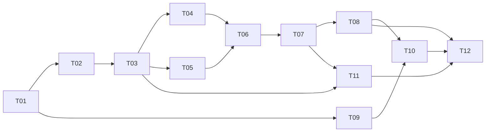

# Phase 1 implementation plan

**PROPOSED, NOT IMPLEMENTED.** Baseline `58dac9c88018674c2e780086953902f1ea135308`, repository `Shotlin/personal-assistant`, shipping Sani. Architecture and schemas are fixed by file 03; this sequence implements that design. No Phase 2/3 implementation, selected provider changes, production actions or RSI experiments are included. A future explicit implementation assignment is required to execute these tasks.

## Working rules and dependency graph

Inspect current HEAD/status/instructions first; preserve unrelated work and never force-reset. Compare any revision drift to the audit before applying this plan. Small compatible drift can be documented; changed ownership/policy/persistence/IPC requires a focused re-plan before dependent changes. Keep existing behavior behind default-off feature flags while testing new paths. Do not use old execution as a fallback around a mission denial.

Each task: write a failing behavioral test → smallest compatible implementation → focused test → named regression group → evidence record. Never weaken an evaluator to make implementation pass. Changes to a flawed existing test need a separately explained oracle and a failing counterexample. No blanket lint/type cleanup. Resolve changed-file issues and separately triage baseline debt; acceptance cannot pretend existing failing checks passed.

T09 audition can proceed after T01 without changing mission code. The diagram denotes dependencies, not authorization to create additional agents. All NEW paths below are proposals, absent at the audited HEAD. Relative paths resolve from the repository root. Tests and commands are defined in file 06. One reviewable patch per task is a suggested organization, not a request to commit.

## T01 — Freeze baseline, regression oracles and configuration compatibility

- **Objective:** reproduce shipping behavior and record debt before extension; make unknown/completed mistakes and cancellation cross-talk observable.
- **Inspect:** `README.md`, `CLAUDE.md`, `pyproject.toml`, `uv.lock`, `tests/conftest.py`, `src/assistant/core/{app,agents,runtime}.py`, `src/assistant/velo/{controller,verify,contracts}.py`, `sani/src-tauri/src/{app_state,runtime,sani_core}.rs`, `sani/scripts/release-mac.sh`, existing tests listed in file 06.
- **Modify:** relevant existing tests only to add regression cases; `src/assistant/settings.py` and host settings only for default-off capability flags. Do not repair product behavior until its owning task.
- **NEW:** `tests/helpers/mission_fakes.py`, `tests/fixtures/missions/` containing redacted synthetic desktop/account/state sequences; `docs/verification/phase1/BASELINE.md`.
- **Interfaces:** fixture model/driver call counters, injected monotonic clock, effect sink, crash hooks, sanitized evidence collector. Default flags false; RSI observation-only.
- **Dependencies:** none.
- **Test first:** unknown side effect cannot become success; two agent runs cancel independently; alternating observations cannot loop forever; legacy parser performs zero model calls. Record tests failing for the expected reason without marking product fixed.
- **Acceptance:** HEAD/dirty status, tool versions, exact commands and failures retained; baseline fixtures deterministic; renderer builds; original input files hashed. Actual STT demonstration remains separate from unit tests.
- **Rollback:** remove only new fixture/config additions; do not alter application data.
- **Stop:** incompatible baseline, unavailable required source, unexpected credentials/live calls or fixtures that affect the real desktop.

## T02 — Define contracts and add atomic mission persistence

- **Objective:** one durable request/mission/plan/step/attempt/event history with deduplication and CAS.
- **Inspect:** `src/assistant/runtime/runs_local.py`, `src/assistant/memory/local.py`, `src/assistant/core/protocol.py`, `tests/unit/{test_runs_local,test_memory_local,test_sani_core_protocol}.py`.
- **Modify:** `runs_local.py` for mission linkage/consistent outcome semantics; `memory/local.py` only for connection/migration coordination; no destructive rewrite or global user_version downgrade.
- **NEW:** `src/assistant/missions/{__init__,contracts,store}.py`; `tests/unit/{test_mission_contracts,test_mission_store}.py`; `tests/integration/test_mission_sqlite.py`.
- **Interfaces:** all file 03 v1 contracts; MissionStore claim_request/commit_plan/claim_step/apply_result/recover_inflight. New tables use independent migration tracking. Unique request identity, execution and event sequence constraints.
- **Dependencies:** T01.
- **Test first:** same ID/same digest returns one mission, different digest rejects; concurrent claims yield one dispatch; stale/duplicate result leaves current state unchanged; crash at every transaction boundary keeps invariant; preserve old memory/run fixture DB.
- **Acceptance:** BEGIN IMMEDIATE CAS transactions, intent+reservation+outbox atomic; no tool await under transaction; existing history/checkpoints survive migration twice/reopen; disk full/corruption blocks mutation with readable error.
- **Rollback:** disable feature after quiescence; retain additive tables and evidence; version-matched backup procedure tested on fixture, never automatic data loss.
- **Stop:** destructive migration required, incompatible schema found, or locking cannot preserve one-writer invariants.

## T03 — Bind scope, approvals, budgets and evidence at dispatch

- **Objective:** model outputs never grant authority; no mutation occurs before durable intent and resource reservation.
- **Inspect:** `src/assistant/tools/{policy,cua,result_normalizer}.py`, `src/assistant/runtime/runs_local.py`, `src/assistant/observability/{logging,usage}.py`, `src/assistant/core/__main__.py`, `src/assistant/memory/policy.py`, `config/cua-capabilities.yaml`.
- **Modify:** these dispatch/normalization/ledger/logging/usage paths and settings to wire additive mission guards, preserve original allowlist/denies and redact exceptions. Do not relax manifest or selected driver mode.
- **NEW:** `src/assistant/missions/{authority,evidence}.py`; `tests/unit/{test_mission_authority,test_mission_evidence,test_mission_budgets}.py`; `tests/integration/test_mission_policy.py`.
- **Interfaces:** ActionIntent→single-use ActionPermit, BudgetCharge/Reservation, ScopeObservation, CheckSpec/Result, EvidenceRef, ApprovalRecord. Every policy-approved mutation requires matching scope/version/epoch/driver/fence and committed intent; screenshot policy applies before any sink.
- **Dependencies:** T02.
- **Test first:** counterfeit model approval, expired/replayed permit, changed arguments, wrong account/origin/window, traversal/symlink, clipboard cross-scope, late budget retry, disk write failure, secret in traceback or image. Assert effect sink and raw evidence sinks remain empty.
- **Acceptance:** existing policy regression tests remain; persistent counters count retries/failed requests across restart; no silent credit charge; unknown price not zero; secret canaries absent from disk/log/model/UI/observer payloads; no raw image tempfile.
- **Rollback:** quiesce mission path, retain records; never bypass a denial with legacy route. Existing deterministic protections remain on.
- **Stop:** app identity cannot be safely established, sanitation cannot be proven, external allowance required, or change would weaken permissions.

## T04 — Adapt Velo to bounded work items and trustworthy verification

- **Objective:** retain recipes/structured JEV while returning finite typed outcomes, not mission completion claims.
- **Inspect:** every `src/assistant/velo/*.py`, `tests/unit/test_velo_*.py`, `test_tool_outcome_conversion.py`, `test_cua_loop_policy.py`.
- **Modify:** `velo/{controller,contracts,adapter,recipes,verify}.py`; preserve parser behavior and structured `jev.py` protocol/provider unless a proven adapter defect requires a compatible correction.
- **NEW:** `src/assistant/missions/executor.py`; `tests/unit/{test_mission_executor,test_mission_verifiers}.py`.
- **Interfaces:** execute_work_item(BoundedWorkItem)→StepResult. Velo's unfamiliar route returns NEEDS_CONTROLLER inside a unit, never calls Deep recursively. Registered `semantic_ui` supports trusted bounded primitives only; no generated script, freeform Jev output or arbitrary tool name.
- **Dependencies:** T03.
- **Test first:** same legacy parsed commands preserve outcomes and zero model calls; compact JEV selects only observed candidate IDs; stale AX index/digest rejects; search text existing before action is insufficient verification; unknown/cancelled never done; unchanged/alternating/oscillating states trip finite breaker.
- **Acceptance:** packets ≤16 KiB, context ≤4096 bytes, payload separate/digested; per-unit counts/deadline enforced; verification independent of worker language; structured exceptions ≤8 KiB; general work has an escape to bounded Controller recovery.
- **Rollback:** default-off mission adapter; retained Velo tests and legacy contract maintained; do not restore known false-success behavior on mission path.
- **Stop:** task needs unrestricted primitives, executor needs whole backlog, or target effect cannot be independently verified.

## T05 — Serialize desktop ownership and make stop authoritative

- **Objective:** one desktop owner, cancellation safe at every awaited boundary, human takeover and host-local emergency latch.
- **Inspect:** `src/assistant/runtime/{desktop_queue,session}.py`, `src/assistant/tools/cua.py`, `src/assistant/core/desktop.py`, `sani/src-tauri/src/{sani_core,hotkey,main,app_state}.rs`, desktop/transport lifecycle tests.
- **Modify:** queue/session/policy bridge and host lifecycle/stop handlers; retain transport's no mutation replay.
- **NEW:** `sani/src-tauri/src/desktop_control.rs`; conditional `sani/src-tauri/native/desktop_control.m` and build linkage only if driver signal unavailable; `tests/unit/test_mission_desktop_queue.py`; `tests/integration/test_mission_desktop_control.py`.
- **Interfaces:** cancellation-safe queue context manager, owner/fence/driver_generation, observed input activity without keystroke contents, stop acknowledgement reporting actual state. Host process lock fences core/driver lifetime; SQLite TTL is not fencing.
- **Dependencies:** T03.
- **Test first:** cancel exactly when queue grants, focus swap immediately before paste, owner dies, stale core wakes, IPC/model stalls during stop, held modifier, concurrent observations corrupt AX index, idle stop. Assert zero post-stop dispatch and no second owner.
- **Acceptance:** ownership logs reconstruct grant/release; pending input invalidated on takeover; capability-tested release or owned-driver shutdown; lost release certainty BLOCKED. Local native stop independent of model/stream operation mutex. Live gates remain required for actual macOS behavior.
- **Rollback:** stop all active holders and reconcile before reverting; retain known-good driver and standard/bounded mode; never takeover by timestamp alone.
- **Stop:** driver lifecycle ownership is ambiguous, native event monitor needs unapproved OS access, or synthetic/human input cannot safely be distinguished.

## T06 — Wire one MissionService and the existing Deep Controller

- **Objective:** mission orchestration above Velo using one existing Deep graph for plan/recovery/review, preserving zero-model local actions and cheap chat.
- **Inspect:** `src/assistant/core/{agents,runtime,app}.py`, `src/assistant/agent/{build,context,profiles,system_prompt}.py`, `src/assistant/velo/controller.py`, mission adapters.
- **Modify:** core runtime/entries and Deep context/tool binding. Replace shared entry `_cancelled` flags with per-run cancellation state. Preserve shared transport, memory, model/provider, no-shell profile and read-only skills.
- **NEW:** `src/assistant/missions/{service,controller}.py`; `tests/unit/{test_mission_service,test_mission_controller}.py`; `tests/integration/test_mission_core.py`.
- **Interfaces:** submit/control/run_ready/accept_result; PLAN/RECOVER/REVIEW/CHAT role capability; schema-valid plan/recovery/final submissions; final terminal state computed by deterministic gate, not FinalReview prose.
- **Dependencies:** T04,T05.
- **Test first:** exact action builds one-step plan with zero Deep/JEV; information question no desktop acquisition/probe; unfamiliar multi-step uses Deep plan once, routine transitions no per-click Deep; recovery only on structured exception; raw CUA mutation denied from Controller even with injected tool reference; two concurrent runs cancel independently.
- **Acceptance:** one graph/runtime, no second general agent framework; every GUI mutation uses mission permit in enabled mode; success requires required steps and independent checks, no unresolved effect; cost/latency recorded per component.
- **Rollback:** disable mission composition only after quiescence; keep database and current policy; no return to legacy execution for rejected mission.
- **Stop:** selected API/model must change, scoped tool enforcement cannot isolate runs, or success requires unsupported verifier.

## T07 — Recover safely and expose compatible mission IPC

- **Objective:** restart/resume never repeats uncertain side effects, and IPC supports controls/events without waiting for a model stream.
- **Inspect:** `src/assistant/core/{app,protocol}.py`, `sani/src-tauri/src/{sani_core,runtime}.rs`, core protocol tests, action ledger/recovery integration fixtures.
- **Modify:** these protocol/stream modules and service/store linkage; ensure one synchronized reader/router and bounded writer, not competing readers. Long waits persist and release current run.
- **NEW:** `src/assistant/missions/recovery.py`; `tests/unit/test_mission_recovery.py`; `tests/integration/{test_mission_ipc,test_mission_restart}.py`; Rust protocol tests inline.
- **Interfaces:** version2 missions.v1 feature handshake, optional fields on run.start, mission.get/list/control/approve/events; durable sequence cursor; CAS controls. Reconciler returns CONFIRMED/NO_EFFECT/UNKNOWN with fresh evidence.
- **Dependencies:** T06.
- **Test first:** kill before/after intent, action submission, result commit, final response; reconnect with duplicate event/result; old host/new core and reverse; malformed/oversized authority fields; control arrives during active stream; clock jump/sleep, external wait beyond runtime timeout.
- **Acceptance:** no automatic resend after ambiguous dispatch; approved retry only proven NO_EFFECT with current scope/budget; late effect recorded without advancing stale plan; terminal events dedup; app restart requires safe resume policy, no hidden background promise.
- **Rollback:** restore compatible host/core bundle after reconciled stop; preserve schema; mixed peers reject mission execution safely.
- **Stop:** external state cannot distinguish performed/not performed, protocol needs unsafe concurrent readers, or existing data requires destructive downgrade.

## T08 — Unify intake, controls and truthful desktop UI

- **Objective:** text and final voice share stable intent identity, corrections invalidate old work, UI displays mission truth and explicit authority.
- **Inspect:** `sani/src-tauri/src/{app_state,runtime,history,main,speech}.rs`, `sani/src/lib/tauri.ts`, `sani/src/{app/MainApp,app/PanelApp,app/OverlayApp,components/MainConversation,components/ActivityTimeline}.tsx`, settings/diagnostics.
- **Modify:** these host/UI files for stable request_id=message identity, status projection and controls, maintaining manual finalization and turn_gen guards.
- **NEW:** `sani/src-tauri/src/missions.rs`, `sani/src/components/MissionStatus.tsx`; Rust behavior tests inline. Renderer fixtures through isolated host test mode proposed in T12.
- **Interfaces:** RequestEnvelope, MissionControl, ApprovalRecord issued by trusted host, mission events with sequence; priority influences queue only, never interrupts active mutation invisibly.
- **Dependencies:** T07.
- **Test first:** repeated partial/final events, identical separate intentional inputs, corrected target while queued/inflight, stale UI approval, pause/resume/cancel while Working, final agent event preceding verification. Unit-test admission through actual handlers, not a duplicate reimplementation.
- **Acceptance:** chat/voice equivalent normalized scope for same confirmed request; partial transcripts never submit; only stable repeated ID dedups; visible PLANNED/RUNNING/WAITING/BLOCKED/NEEDS_APPROVAL/PAUSED/VERIFYING/COMPLETED/FAILED/CANCELLED; unknown is explicit; approvals show exact action/scope/expiry; no fabricated completion in text/activity/voice.
- **Rollback:** feature-off UI returns existing shell only after safe stop, retains mission history; preserve STT controls and history.
- **Stop:** desired barge-in implies background auto-submit, scope clarification is missing, or renderer can forge trusted owner approval unchecked.

## T09 — Audition and package a local output worker

- **Objective:** select one measured locally running voice engine with legally usable assets and pinned reproducible build.
- **Inspect:** `sani/src-tauri/python/sani_stt.py`, `sani/src-tauri/src/{speech,audio,setup}.rs`, `sani/scripts/{build-sidecar,build-core,release-mac}.sh`, Cargo/build configuration, file 10 source/licence comparison.
- **Modify:** packaging/setup/notices only as necessary for separate output worker; do not change STT dependency environment or existing API selection.
- **NEW:** `sani/src-tauri/python/sani_tts.py`, `sani/tts/{pyproject.toml,uv.lock}`, `sani/scripts/build-tts.sh`, `sani/src-tauri/src/{tts,tts_protocol}.rs`, `tests/unit/test_sani_tts_protocol.py`, `tests/fixtures/voice/audition.txt`, `docs/verification/phase1/VOICE_SELECTION.md`.
- **Interfaces:** file03 EngineAdapter, framed TtsRequestV1/PcmChunkV1, explicit pinned asset manifest including hash/source/licence/voice. Worker receives no credentials or tool handles.
- **Dependencies:** T01; asset acquisition requires permitted source/access terms, hardware capacity check and owner audition. It does not authorize accepting gated terms for owner.
- **Test first:** fake chunk generator malformed frames/NaN/oversize/out-of-order/cancel; then at most two actual local candidates in isolated environments with network observation after installation.
- **Acceptance:** one selected engine with reproducible lock/asset manifest; offline cold/warm speech; measured packaging size/RSS/CPU/first audio/RTF; chosen voice owner audition passed; compatibility minimum confirmed or accurately restricted before release. No cloud fallback.
- **Rollback:** output disabled, text plus untouched STT remain; remove only task-owned downloaded candidate assets after retaining licensed manifest, never user's models.
- **Stop:** voice rights or account terms unclear, hardware incompatible, required download unauthorized, or engine needs provider switch. Continue independent mission tasks; report voice BLOCKED.

## T10 — Stream playback, stop speech and preserve voice input

- **Objective:** bounded playback queue with clean cancellation and no self-listening/duplicate mission submission.
- **Inspect:** `sani/src-tauri/src/{audio,speech,app_state,hotkey,settings,onboarding}.rs`, existing STT finalization tests, TTS protocol.
- **Modify:** these host files plus `main.rs`, TTS worker and `sani/src/app/settings/{FullSettings,SettingsContext}.tsx` for output preferences, truthful readiness, interlock; current input engine stays intact.
- **NEW:** `sani/src-tauri/src/tts_queue.rs`; Rust queue/interlock behavior tests inline; `tests/unit/test_sani_tts_worker.py` for worker cancellation/backpressure.
- **Interfaces:** separate speech.stop and mission controls, utterance generation, bounded queue (3 requests/2 seconds PCM), output-device state, committed speech segments.
- **Dependencies:** T08,T09.
- **Test first:** cancel load/synthesis/playback, stale chunk after cancellation, device swap, long reply, two reply generations, PTT during speech, manual Finish&Send and watchdog while worker fails; synthesized spoken command cannot enter mission intake.
- **Acceptance:** local output streams; stop clears all stale audio and reports playback state; PTT stop precedes capture; optional acoustic interruption stays off until echo gate passes; no background submission; mission completion independent of playback success; voice disabled text fallback clear.
- **Rollback:** disable output and restore known-good input path without replacing STT binary or models.
- **Stop:** input regression or self-trigger observed, device cannot drain predictably, or automatic capture would bypass finalization controls.

## T11 — Wire trace/cost evidence and observation-only learning

- **Objective:** reconstruct mission reality/corrections and produce supported recommendations without changing execution behavior.
- **Inspect:** mission event/outbox/evidence store, `src/assistant/observability/{usage,timing,logging}.py`, `src/assistant/core/{runtime,__main__}.py`, `sani/src-tauri/src/history.rs`, diagnostics renderer.
- **Modify:** shipping usage callbacks/timing/structured redacted logging; read-only diagnostics projection, not source-of-truth duplication.
- **NEW:** `src/assistant/missions/observer.py`; `tests/unit/test_mission_observer.py`; `tests/integration/test_mission_observability.py`; `docs/verification/phase1/TRACE_SCHEMA.md`.
- **Interfaces:** versioned TraceEvent and ObserverRecommendation; read-only export input plus separate recommendation sink; explicit component/skill versions, uncertainty, evidence links, token/cost unknown flags.
- **Dependencies:** T03,T07.
- **Test first:** repeated pattern with support vs unrelated failures, single-instance high-impact label, human correction trail, unsupported success, malicious event proposing activation, observer write attempts; retention/deletion/hold behavior; model/API errors missing usage.
- **Acceptance:** one trace per mission, reconstruct major intents/outcomes, all corrections and failures retained safely; agent report separate from measured result; production code/settings/skills hashes unchanged by Observer; budget0 experiment counter and no runner; trace-chain limitations disclosed.
- **Rollback:** turn Observer consumer off without losing mission logs; preserve recommendations separately; never roll back safety event persistence to restore throughput.
- **Stop:** event payload would retain secrets, observer requires execution authority, or evaluator/candidate framework is being pulled into P1.

## T12 — Validate the shipping path, package and hand off

- **Objective:** demonstrate Phase 1 on actual Sani source bundle and declare every unverified gate honestly.
- **Inspect:** all diffs, file06 gates, `sani/src-tauri/{tauri.conf.json,build.rs}`, build/release scripts and manifests, current instructions/skills and old docs.
- **Modify:** necessary source docs, release manifest generation and THIRD_PARTY_NOTICES; no generated build trees committed. Fix only demonstrated Phase 1 defects; source revision recorded at build time.
- **NEW:** `tests/e2e/test_sani_missions.py`, `tests/e2e/test_sani_voice.py`, `tests/e2e/test_sani_safety.py`, `tests/performance/test_mission_budgets.py`, `scripts/verify_phase1.py`, fixture-only isolated host harness/manifest, `docs/verification/phase1/` evidence and completed handoff.
- **Interfaces:** test launcher rejects real profile/DB paths, allows fixture app/window and temporary artifact directory only; live flag plus scope/allowance required. Machine-readable result schema defined in file06. Existing legacy E2E remains but cannot stand for shipping acceptance.
- **Dependencies:** T08,T10,T11 and all earlier gates.
- **Test first:** validation launcher with missing approval scope, profile collision or mismatched packaged SHA refuses; false completion deliberately injected makes acceptance fail; stale schema/asset bundle cannot be signed off.
- **Acceptance:** all required Phase 1 gates PASS with retained evidence; unresolved blockers mean IMPLEMENTED / NOT ACCEPTED, not complete. Matched baseline/candidate metrics and owner voice audition recorded. Same-bundle restart/rollback demonstration; unchanged providers/driver mode; file07 fully filled.
- **Rollback:** prove quiesce → reconcile → flags off → version-matched restore on fixture data; report residual unknown effects. Do not deploy or overwrite installed production application.
- **Stop:** live authorization/evidence unavailable, evaluator must be weakened, any duplicate/wrong-target effect, unsafe stop, privacy leak, or packaging provenance mismatch. Finish unaffected documentation and report exact blocker.

## Phase boundary

After T12, return changed-file list, diff, commands/results, measurements, known debt, live scope, artifact paths and handoff. Do not commit/push/deploy absent separate authorization. Do not start Phase 2. A fresh Astra planning run evaluates the actual repository and accepted Phase 1 evidence first.
