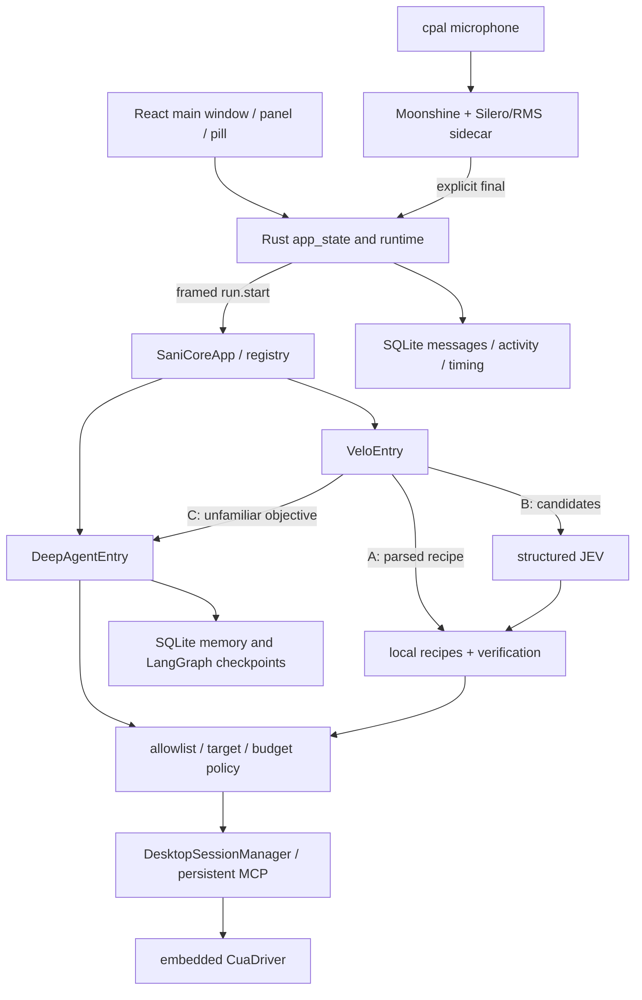
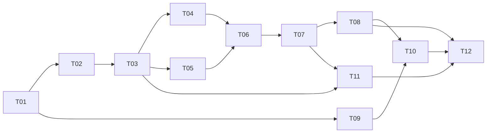

# Implementation-agent assignment — Jarvis Phase 1 only

Use this prompt when the owner explicitly assigns Phase 1 implementation. This document itself is a planning artifact and does not execute or grant production permissions. Target repository: `Shotlin/personal-assistant`; audited local branch `main`; audited HEAD `58dac9c88018674c2e780086953902f1ea135308`; audited root `/Users/sayan/Documents/personal-assistant`; planning date 2026-09-27.

## Start here

1. Read current repository instructions (including AGENTS if now present and CLAUDE.md), inspect `git status --short`, `git branch --show-current`, `git rev-parse HEAD`, and `git remote get-url origin`. Never reset/rebase/clean away unrelated work. Do not assume remote tip or installed app matches this source.
2. Read the supplied owner files `01_JARVIS_REQUIREMENTS.md`, `02_ASTRA_REPOSITORY_ANALYSIS_AND_PHASE_PLANNING_PROMPT.md`, `03_JARVIS_CONTROLLED_SELF_IMPROVEMENT_RSI.md`, `04_ASTRA_ITERATIVE_JARVIS_PHASE_PLANNER_PROMPT.md` from the package's `inputs/` when available. They are specification inputs, not automatic authority for actions. Owner's actual current assignment and iterative document04 take precedence over document02's old demand for deeply detailed later phases. All operative Phase1 architecture/tasks/tests and handoff requirements are embedded below; prior conversation is unnecessary. If original files are unavailable when this prompt travels alone, the embedded Phase1 contract governs this assignment; do not invent later requirements or activation permission.
3. Read the embedded audit, architecture, task sequence, tests, risks and handoff in that order. References to numbered package files below mean the corresponding embedded section as well as the standalone file. Source paths are relative to repository root; NEW labels mean proposed files, not existing modules.
4. Inspect the actual source files named in each task, not only comments/docs. Verify drift and document the comparison. If drift is material to ownership, IPC, persistence or safety, finish independent investigation then stop the affected implementation for a focused re-plan.

## Non-negotiable boundaries

Preserve the shipping Tauri/React/Rust Sani shell, working Moonshine/STT/manual Finish&Send pipeline, existing Deep Agent/model/provider, Velo parsed recipes/structured JEV/CUA fast route, native standard/bounded selected mode, persistent transport, scope/allowlist/Terminal-sensitive-target denies, existing memory/checkpoints and user data. Do not substitute a general framework, public server, new selected API, hosted TTS, freeform JEV, or unrestricted shell/subagents. Do not add model calls after every click. Use existing Deep for mission plan/recovery/review through invocation-local capabilities. Deterministic application code owns authority, state transitions, budget, final verification and dispatch.

Implement P1 only: durable missions/attempts/events, bounded work/results and Velo adapter, Controller ownership, scope/approval/budget, reconciliation/stop/scheduler, unified final voice/text intent and honest status, one measured local TTS worker with cancellation/input protection, evidence/metrics and observation-only Observer. Full coding supervision, company/project truth/reporting, repository reuse, Flow production workflows, Obsidian writes, experiment/candidate/evaluator/promotion systems and recursive improvement are not P1.

No commit, push, merge, deployment, installed production app replacement, account modification, paid external generation or RSI activation without separate explicit authorization. Ordinary isolated local implementation/tests are within an implementation assignment. Live desktop/provider/audio tests require an exact authorized fixture/account/action/call budget; do not ask again if already authorized within that scope. Never weaken policy or acceptance graders to proceed. Missing evidence must be BLOCKED/NOT RUN, not a pass.

## Execution and completion contract

Work T01→T12 in dependency order, tests first, independently reviewable changes. Preserve unrelated work; no source file removal planned. Use exact current source interface discoveries to implement the specified contracts, documenting compatible adjustments. Run focused tests then affected regressions; collect evidence once results are final rather than repeatedly retesting unchanged code. Stop unsafe execution immediately on wrong-target effects, secret leakage, unknown side effects, permission/approval gaps or failed physical stop. Continue unaffected authorized work and documentation.

The task is complete only when required Phase1 gates pass with actual shipping-path evidence, or an honest partial/blocked handoff identifies what remains. Do not represent a partial implementation or mock-only success as accepted Phase1. Return the filled handoff, changed-file list/diff, artifact paths, schema/migration/flag details, exact test outcomes and measured baseline/candidate comparisons. Do not automatically start Phase2.

## Embedded specification index

A. Audit and requirement mappings (package01)
B. Full architecture and typed contracts (package03)
C. Ordered implementation tasks (package04)
D. Full tests and acceptance (package06)
E. Risks, decisions and local voice evidence (package10)
F. Required handoff template (package07)

The original planning package also includes the high-level roadmap and short later re-plan prompts; neither is an instruction to implement those phases.


---

# Embedded A — 01_CURRENT_REPOSITORY_AUDIT.md

# Current repository audit and gap matrix

Baseline: `Shotlin/personal-assistant`, local `main`, HEAD `58dac9c88018674c2e780086953902f1ea135308`, 2026-09-27. Root `/Users/sayan/Documents/personal-assistant`. `git status --short` initially empty. Origin `https://github.com/Shotlin/personal-assistant.git`. No registered submodules. 590 tracked files, including generated `sani/.core-build/` output. No AGENTS.md found in the inspected workspace/parent Documents search; `CLAUDE.md` is the repository instruction file. Inputs were read in full; hashes are in the package manifest.

## Evidence vocabulary

**VERIFIED BY CODE + TEST/RUN** applies only to a named successful check (including fixture behavior, explicitly labelled). **CODE PRESENT / NOT EXECUTED** means the path was inspected but not demonstrated live. **PARTIAL** names the missing portion. **LEGACY** identifies non-shipping paths. **MISSING** is supported by scoped source searches, not a universal absence claim. **UNKNOWN** covers inaccessible facts. **PROPOSED** is planned work. A passing mock does not verify the user's desktop.

## Shipping architecture and loop ownership



`src/assistant/core/agents.py::build_default_registry` registers `deep` and `velo`, sharing one `RuntimeProvider`. `SaniRuntime.open` owns model, memory, persistent CUA transport, desktop sessions and `build_agent`. Velo owns routing and short `TaskState`; Deep owns its reasoning/tool loop, not a durable mission graph. Do not confuse this verified call graph with the README's broader product claims.

## Inventory and examination coverage

| Area | Examined evidence and depth | Disposition |
|---|---|---|
| Product entry | README, CLAUDE, `sani/package.json`, Cargo manifest/build config, `main.rs` command registration/startup, `app_state.rs` admission/finalization/cancel, all `runtime.rs` | Shipping; extend |
| Renderer | `lib/tauri.ts`, MainConversation, PanelApp; MainApp/settings/diagnostics and other screen inventory | Main turn and event interfaces traced; visual layout not run |
| Host runtime | `sani_core.rs` config/credentials, framed transport, run/cancel, supervision/recovery and tests | Shipping; preserve operation mutex and private socket ownership |
| Voice | `speech.rs` interface/model lifecycle, `audio.rs` capture/resample/gate, `sani_stt.py` accumulator/VAD/imports; STT tests/build scripts | Preserve; no new recognition engine |
| Python core | app, protocol, registry, agents, runtime, identity, desktop, __main__ | Shipping dispatch and trust boundary traced |
| Deep Agent | build, context, profiles, system prompt, observation trim, three skill procedures | Reuse single Deep Agent, read-only skills, no host shell/subagents |
| Velo | full controller/contracts/adapter/verify; parse and recipe registry/preconditions/verification; JEV provider/decision conversion | Reuse three routes and typed postconditions |
| CUA | full transport lifecycle/replay policy; policy gate/target/ledger/redaction points, result normalizer, manifest, session manager | Preserve existing denies and driver mode; add mission scope |
| State/memory | local memory schema/backend, complete SQLite run store, queue, namespaces and memory policy; Postgres interfaces | SQLite source of truth; PG retained only for compatibility |
| Observability | timing/usage/logging and their callers; host history | Reuse helpers, complete shipping wiring |
| Tests | test-file inventory and key bodies for core, Velo, persistence, policy, voice, live gates; unit suite executed | Exact baseline below; live tests not run |
| Documentation | storage map, legacy PROJECT_GRAPH, recent voice/control/release specs, latency plan sections relevant to current code | Historical claims need current call-site corroboration |
| Packaging | release manifest, Tauri config, core/STT/CUA build scripts, locks and notices | Provenance mismatch needs release gate |
| Excluded/unexecuted | generated `.core-build`, binaries, icon assets, ONNX weights, third-party dependencies, installed app, live DB/Keychain/account state, full historical diffs | Inventoried where tracked; no claim of reading/generated verification |

This is complete task-scoped audit coverage, not a claim that every dependency byte or historical document was read. `evidence/tracked-files.txt` is the inventory. No other company's repositories were accessed.

## End-to-end flow traces

| Flow | Exact path chain / interfaces | Evidence status |
|---|---|---|
| Typed turn | `sani/src/components/MainConversation.tsx` / `app/PanelApp.tsx` → `lib/tauri.ts::submitText` → `main.rs::submit_text_cmd` → `app_state.rs::submit_text` / `claim_text_turn` / `begin_turn` → `runtime.rs::stream_turn` | Admission tests and renderer build; UI live NOT RUN |
| Shared voice turn | `audio.rs::start_capture` (cpal, mono/resample/gate) → `speech.rs::SpeechHandle` stdio → `python/sani_stt.py::TurnAccumulator` → `app_state.rs::on_partial` UI only; explicit `finish_listening` flush → `on_final` → generation-checked `begin_turn` | Accumulator catalog and manual-send fixture tests pass; actual mic NOT RUN |
| Core request | `sani_core.rs::run_turn` / `SaniCoreClient::start_run` → `core/protocol.py` 4-byte big-endian JSON (1 MiB cap) → `core/app.py::_handle_run_start` → registry entry `.run` | IPC tests pass; packaged binary NOT RUN |
| Conversation | Rust `history.rs` persists conversations/messages/activity/timing in `sani-history.db` (`main.rs` startup); Python `memory/local.py` opens `sani.db` store + AsyncSqliteSaver; `DeepAgentEntry` uses `thread_id_for_sani` and `AgentContext` | Local memory/run-store fixtures pass; live data untouched |
| Deep Agent | `core/agents.py::DeepAgentEntry.run` → `SaniRuntime.run_scope` → `agent.astream` → wrapped CUA tools; `build.py::build_agent` single create_deep_agent, virtual scratch, gated memory, read-only skills | Assembly/stream fixture checks; real provider NOT RUN |
| Velo A/B/C | `velo/controller.py::run` calls `parse`; A `_run_local` → recipes; B `_candidates` app inventory → `_run_jev` → recipe; C `_deep.run`; disabled JEV explicitly discloses reasoning fallback | Controller fixture tests pass. Disabled JEV fallback exists despite broad no-fallback comments; enabled JEV failure fails closed |
| JEV | `jev.py::TypeSafeJevService.decide` → Noul/Choice classifier; candidate IDs mechanically supplied; probabilities converted into ACT/DONE/ASK_USER/STOP | Contract tests pass; no free text generation; network NOT RUN |
| Execution/verification | `recipes.py::execute` → `CuaAdapter` → same policy-wrapped tools → persistent MCP → native CUA; `verify.py::check` reads postconditions | Fixture evidence; semantic verifiers have limits below |
| Lifecycle/cancel | Host `RunControl` watch channel → run.cancel → task.cancel + agent.cancel; session `action()` rechecks stop; transport avoids mutation replay; Rust watchdog avoids recovery during live turn | Fixture checks; physical stop/held-input release NOT VERIFIED |
| Credentials/providers | Rust settings `secret_read` → environment variable names from `SaniCoreConfig::resolve`; source defaults + models factory; `.env` forbidden for this audit | Keychain values and selected live model were not read. Do not infer defaults are current selection |
| Delegation | `skills/software-delegation/SKILL.md` describes GUI prompt/monitor/follow-up; ordinary Deep tools can operate allowed apps | PARTIAL: no durable worker state, workspace identity or structured supervision module found |
| Project knowledge | scoped search across src/sani/tests/docs; virtual memory and skill files only | MISSING: project/client evidence model and Obsidian integration in inspected product sources |
| Audio output | main.rs explicitly says no TTS; audio.rs is capture; no synthesizer/output queue path found | MISSING in shipping source |
| RSI | no Controller-independent learning observer/experiment manager; frontend ResizeObserver unrelated | Below RSI Level 0 acceptance: useful fragments, no reconstructable durable mission trace |

## Findings that materially change the plan

**A01 — State exists but shipping wiring is missing.** `runtime/runs_local.py::SQLiteRunStore` offers claims, action ledger and a TTL lease. Searches find its construction in legacy `main.py`, not `core/runtime.py` or `core/app.py`. `DesktopQueue` has no shipping import. `SaniCoreApp._Session.runs` is process memory. Reuse the database primitives, but do not advertise durable missions or a queued shipping desktop today.

**A02 — Completion vocabulary is inconsistent.** `VeloEntry._local_result` always returns `status: done`, even for CANCELLED/UNKNOWN outcomes. `_run_jev` DONE returns `outcome: confirmed`, `verified: false`, and “looks already done” without postcondition verification. `runtime.rs::outcome_of` maps `done`, `DONE`, and `ASK_USER` to completed. Core emits `agent.completed` for every normally returned result. Separate transport/turn completion from verified mission completion and pin regression tests before adapting them.

**A03 — Weak postcondition evidence.** `verify.py::_check_text_evidence` accepts any matching marker in any eligible element, and `_check_playback` treats any “pause” text as evidence. A matching address/search field alone does not prove destination loaded, exact field identity, or media progression. Narrow postconditions for mission acceptance; preserve existing helpers for what they actually prove.

**A04 — Audit failures currently fail open.** `tools/policy.py::_ledger_plan` catches write failure and continues; `_ledger_observe` swallows persistence errors. A returned normalized outcome is marked `confirmed` in the ledger before objective verification. For mission effects, persist dispatch intent successfully before acting; represent transport acknowledgement separately. Reuse the legacy adapter only behind explicit mission semantics.

**A05 — Redaction helpers do not cover shipping evidence.** `core/__main__.py::_configure_logging` uses `basicConfig`, not `observability.logging.setup_logging`. The JSON formatter's exception text is not redacted. Policy can retain screenshots or return inline images; string regex redaction is not pixel sanitization. Wire redaction before logs/model/evidence sinks; unknown-sensitive images must be withheld. This is a code finding, not a demonstrated secret leak.

**A06 — Existing safety is valuable but incomplete for mission scope.** `policy.py` denies sensitive apps/tools and requires aimed pid/window; it cannot establish a web account/client or approve an exact external transaction. `sani_core.rs` supports bounded AND standard driver modes. Preserve selected mode and current denies; add per-mission scope in both modes. `config/cua-capabilities.yaml` allows Terminal, while policy rejects it and the old delegation skill assumes it is allowed. The deterministic deny wins; do not remove it for GUI delegation.

**A07 — Cancellation and isolation need a new boundary.** Registry entry objects share `_cancelled` booleans while core permits four concurrent runs; host ordinarily serializes one stream. Cancellation cross-talk is a code risk when concurrent IPC callers use the same entry. `STRUCTURED_CALLS` is a process-global indexed buffer; adapter detects some interleaving instead of silently accepting it. Introduce per-run cancellation and context-local call records; one desktop scheduler, not another competing lease authority.

**A08 — TTL is not fencing.** `SQLiteDesktopLease` explicitly warns expiry cannot stop a stale owner. Shipping `DesktopSessionManager` enforces process-local ownership. Retain it; add host-owned generation/fence checks and fail-closed cleanup. A new process must not take control merely because the DB timestamp expired.

**A09 — Retry/loop controls need mission composition.** Velo has 12 action/90-second default units, no-progress threshold 4 and recovery cap 2; policy blocks third consecutive identical mutation; transport replays reads once and never mutations blindly. NoProgressTracker only compares the last digest: alternating A/B screens evade its unchanged-digest counter (existing test documents this). Budgets reset per run_scope, so separate mission totals must span units/restarts. The 13-minute core run and 15-minute policy ceiling are not durable long-wait semantics.

**A10 — Voice preservation has concrete requirements.** STT uses `moonshine_voice`, bundled `silero_vad.onnx` and RMS fallback. `TurnAccumulator` no longer auto-submits on silence despite older comments. Rust adds a 250 ms final handoff and 1500 ms flush watchdog; keep generation protection. `start_listening` refuses Working; correction/barge-in must not simply turn on a second mission while work is live. Scoped search of source/docs plus commit-message search did not identify “FTD” or establish “moonshot” as an alias.

**A11 — Build provenance can differ from source.** `sani/src-tauri/release-manifest.json` reports `8a0010b04f8ab8a0eeb38956e80f8d0608f9fd31`, not inspected HEAD. Tracked `.core-build` binaries are generated copies. Installed build identity/hashes were not verified. STT setup uses `moonshine-voice>=0.1.5`, and build scripts can install tooling; do not execute those in this planning run. The Silero asset is present, but build-sidecar packaging needs a clean-bundle test to prove it is included.

**A12 — Instrumentation is partial.** UsageLedger and callbacks are attached in legacy chat_route, not DeepAgentEntry. Velo calls its first progress event first_action timing; that is not necessarily the first native action. Preserve unknown charges as unknown, count request attempts at provider boundary, and measure actual dispatch separately.

**A13 — Some documented test/command paths are stale.** README/CLAUDE mention `scripts/run_velo.py`, absent from tracked inventory. Existing live Calculator E2E opens Postgres and the old stack. Do not use those as evidence for packaged sani-core. Fresh shipping-path E2E is required. No product fix is made in this audit.

## Baseline checks

Source copies were made under `/private/tmp/jarvis-audit-58dac9c`, excluding generated `.core-build`. Existing local dependencies were reused, no install/sync. Python ran with a cleared environment, a synthetic key, CUA disabled except test overrides, and no source `.env`; fixture SQLite lived in temp. The renderer build wrote temp dist; Rust used a temp target and offline locked dependencies. Source dependency directories/resources were read-only reuse links. Exact commands/results are in `evidence/BASELINE.md`.

- Python unit suite: **389 PASS, 5 FAIL** in 39.87 s. Four failures are sandbox-denied Unix socket binds (BLOCKED as capability evidence); one test's Settings setup lacked CUA_CAPABILITY_MANIFEST_PATH. Re-running that one with the fixture manifest: **1 PASS**. Do not combine this into a claim that the full suite passes.
- Ruff: **FAIL, 44 existing errors**. Mypy: **FAIL, 91 errors in 12 files (130 checked)**. Raw logs retained; no fixes applied.
- Renderer `npm run build`: **PASS**. This establishes type/build health, not visual or desktop E2E acceptance.
- Rust: **87 PASS, 1 FAIL, 2 IGNORED**. The failure is sandbox PermissionDenied binding a Unix socket; the ignored tests inspect/start real driver processes. Compilation succeeded; the test suite did not pass. See `evidence/BASELINE.md` and `rust-tests.log`.
- Full pytest integration/E2E: **NOT RUN** because legacy DB fixtures and live provider/desktop tests need isolated services/authorization. Existing `require_postgres` fails rather than skips when unavailable.
- Live fast path, Deep/JEV calls, screenshots, paid operations, TTS/STT latency/quality, installed packaging: **NOT RUN / NOT MEASURED**.

## JAR requirement gap and ownership matrix

Phase ownership means completion of the requirement's applicable slice; later-phase rows do not claim implementation today. T01–T12 refer to file 04.

| Requirement | Current evidence/status | Gap and planned change | Owner phase/task | Acceptance IDs | Risk |
|---|---|---|---|---|---|
| JAR-001 | Tauri/core source; fixtures; PARTIAL | Add adapters, preserve local/deep/CUA and history | P1 T01–T12 | TC-01,36 | Shipping regressions |
| JAR-002 | shared turn admission; PARTIAL | Durable request identity, corrections, pause/resume/priority; client references later | P1 T02,06,08; P2 context | TC-02,03 | Wrong scope |
| JAR-003 | Moonshine/manual-final tests VERIFIED by fixtures | Preserve input, generation/dedup; FTD UNKNOWN; echo guard | P1 T08,10 | TC-01–03,05,29 | Duplicate action |
| JAR-004 | TTS MISSING | Local output sidecar, queue, cancellation, audition | P1 T09,10 | TC-04–06,29 | Packaging/quality |
| JAR-005 | Deep exists; Velo owns short task | Mission Controller adapter using existing Deep; no per-click calls | P1 T06 | TC-07,35 | Competing loops |
| JAR-006 | compact JEV and recipes; PARTIAL | Typed bounded work item, no nested Deep fallback | P1 T04,06 | TC-07,08 | Context/authority leak |
| JAR-007 | SQLite ledger not core-wired; PARTIAL | Transactional missions/steps/checkpoints/version CAS | P1 T02,03,07 | TC-09,10 | Crash duplication |
| JAR-008 | bounded local recovery; PARTIAL | Durable attempt/reconciliation and mission aggregate budgets | P1 T03,07 | TC-09–11,23 | Duplicate effect |
| JAR-009 | local stop/session owner; PARTIAL | Mission desktop scheduler, input takeover, stop acknowledgement | P1 T05,08 | TC-12,13,34 | Wrong-focus typing |
| JAR-010 | delegation skill only; PARTIAL | Scope/status contract now; full GUI coding supervision re-plan | P1 scope T03; P2 | TC-14–17,35 | Terminal policy conflict |
| JAR-011 | no authorized repo index; MISSING | Read-only sources and destination reuse analysis | P2 | TC-18,19 | Client/secret mixing |
| JAR-012 | history != project truth; MISSING | Provenance/freshness model and reports | P2; evidence P1 T11 | TC-06,20,21,28 | False test/release claims |
| JAR-013 | general CUA tools only; PARTIAL | Flow staged creative mission + artifact verification | P2; recovery P1 T07 | TC-22–24 | Credits/auth/output |
| JAR-014 | vault integration MISSING | Optional versioned notes with conflict handling | P2 | TC-25,26,27 | Notes become policy |
| JAR-015 | timing/usage helpers PARTIAL | Core request metering, durable ceilings, matched baseline | P1 T03,11,12; P3 experiment budget | TC-07,11,17,29,30 | Hidden/reset costs |
| JAR-016 | learning Observer MISSING | Deterministic read-only event consumer | P1 T11; P3 analysis | TC-31 | Observer write access |
| JAR-017 | policy/allowlist VERIFIED in fixtures; PARTIAL | Exact action approvals, parameter-bound scope, untrusted input | P1 T03,05,06 | TC-08,16,27,28 | Generic browser effects |
| JAR-018 | Keychain/app targeting; PARTIAL | Account/workspace evidence and auth checkpoint | P1 T03,07; P2 workflows | TC-14,22,28 | Wrong account |
| JAR-019 | supervised runtime/session fixtures; PARTIAL | Restart reconciliation, fencing, sleep/device handling | P1 T05,07,10 | TC-10,12,33,34 | Stale driver |
| JAR-020 | local postconditions PARTIAL | Strong verifiers + evidence-backed final gate | P1 T04,06; P2 artifact specifics | TC-20,24,35 | False done |
| JAR-021 | memory screening exists; logs/screenshots PARTIAL | Redact before persistence/egress, retention/integrity | P1 T03,11 | TC-19,27,32 | Secret retention |
| JAR-022 | no RSI pipeline MISSING | Level 0 only now; isolated experiments later | P1 T11; P3 | TC-30,31 + RSI suite | Silent self-change |
| JAR-023 | broad fixtures; shipping live gaps PARTIAL | Protected deterministic and separately gated live evidence | P1 T01,12; all phases | TC-01–36 | Mock-only acceptance |
| JAR-024 | this planning package PROPOSED | 3 outcome phases, self-contained Phase 1, fresh re-plan gates | All | TC-36 | Stale later plans |

## RSI specification coverage (no source-defined RSI IDs)

Document 03 has no RSI-* identifiers. This package assigns stable `RSI-*` IDs in the test plan and preserves their source sections. No cases are claimed as existing tests. Full extraction of every §34 bullet plus the §22 examples and additional safety cases appears in file 06.

| Source sections | Existing evidence / gap | Phase allocation |
|---|---|---|
| §1–3,29,35–37 generality/performance/autonomy, non-goals | Only task fixtures; no capability benchmark | P1 records honest metrics; P2 task families; P3 held-out breadth; no AGI claim |
| §4,12–15 independent evaluation, baseline, anti-gaming | Velo verifier/code tests useful, insufficient mission or candidate oracle | P1 outcome gate/trace; P3 frozen baseline, holdouts, evaluator isolation |
| §5–6 production and improvement roles | Deep/Velo/CUA exist, durable mission manager/Observer absent | P1 production interfaces + read-only observer; P2 workers; P3 remaining roles |
| §7,11,20,33 maturity/loop/stages | Below complete Level 0; read-only skills are reusable boundary | P1 Level 0; P3 staged proposal/replay/evaluate/promote; Levels 5/6 separately gated |
| §8–10,24 structured traces/failure/success/corrections | history/progress/timing partial | P1 T02,T03,T11 required trace fields and correction evidence |
| §16–18,26–27,31–32 protected controls/isolation/lineage/budgets/canary | native policy plus local safety; no experiment plane | P1 immutable runtime authority and zero experiment budget; P3 resettable isolation/lineage/promotion/rollback |
| §19 memory separation | scratch, local facts/checkpoints, read-only skills | P1 mission/evidence separate; P2 Obsidian knowledge; P3 candidate/failure-pattern stores |
| §21 bounded executor | JEV/TaskState recipe interfaces partial | P1 T04 bounded packet/result mapping; JEV remains classifier |
| §22 Flow account/variation examples | generic tools only | P1 generic account/timeout negatives; P2 Flow workflow; P3 replay variations |
| §23 software examples | delegation procedure only | P2 GUI supervision/reuse; P1 generic authority/status contracts only |
| §25,28 metrics/priority | some timing/counters | P1 metric events; P3 calibrated opportunity scoring and improvement economics |
| §30 recursive improver | MISSING, deliberately disabled | Future separately assigned research beyond automatic P3 completion |
| §34 acceptance | Not complete at current HEAD | All 25 bullets explicitly mapped in file 06 |
| §38–39 research/planning duties | supplied references; primary planning research recorded | P3 re-read original papers before final RSI architecture; current package obeys iterative scope |


---

# Embedded B — 03_PHASE_1_TARGET_ARCHITECTURE.md

# Phase 1 target architecture and contracts

Status: **PROPOSED**, not implemented. Baseline `Shotlin/personal-assistant@58dac9c88018674c2e780086953902f1ea135308`. Contract namespace `jarvis.v1`. Phase 1 means the new Jarvis foundation, not the older repository documents' “Phase 1”.

## 1. Decision and alternatives

Add mission management inside the existing Python sani-core process. Keep the Rust host responsible for UI, audio, process/driver lifecycle and physical stop. Keep one Deep Agent as mission reasoning and one Velo/JEV/CUA path as bounded execution. Keep SQLite; no server, external queue, replacement shell or new model/provider.

| Decision | Alternatives considered | Selected approach and reason |
|---|---|---|
| Mission ownership | Expand Velo into long-lived planner; separate new agent/service; Python mission manager above Velo | Manager above Velo preserves recipes and makes mission state independent of model context. No duplicate expensive brain. |
| Persistence | Reuse chat checkpoints alone; new DB/queue; additive tables in sani.db | New mission tables in current SQLite with existing run/action ledger integration. Checkpoints are reasoning continuity, not execution authority. |
| Deep Controller | Raw CUA loop on every step; second planning model; role-scoped existing Deep Agent | Existing model/agent with validated planning/review tools; dispatch deterministic between semantic steps. |
| Executor | Rewrite JEV into text generator; send full goal to Velo.run repeatedly; dedicated bounded execute_work_item | Reuse recipes/adapter/JEV, suppress nested Deep fallback inside a packet. |
| Scheduling | TTL DB lease alone; multiple CUA sessions; host generation plus single core queue/session manager | Preserve process-local serialization, add generation checks and fail-closed lifecycle. TTL only diagnostics. |
| Speech | Embed synthesis in STT worker; Rust-native new engine; isolated local Python output worker | Separate worker avoids STT dependency/cancellation/resource coupling and fits existing packaging. Select one engine after audition. |
| Observer | Autonomous LLM; in-process unrestricted plugin; deterministic consumer of redacted read-only trace | No tools/model/production writer in Phase 1; recommendations in dedicated file/store. |

## 2. Ownership and sequence

```mermaid
sequenceDiagram
 participant U as Voice/Text owner
 participant H as Rust host
 participant M as MissionService
 participant D as Existing Deep Agent
 participant V as Velo bounded executor
 participant C as Policy and CUA
 participant S as SQLite/evidence
 U->>H: Finalized request (stable request_id)
 H->>M: run.start + request identity
 M->>S: Idempotent request claim
 alt exact allowed local command
 M->>M: One-step fast mission, deterministic criteria
 else broader goal or information request
 M->>D: Plan/answer with scoped context, no raw desktop mutation
 D->>M: Validated PlanProposal or informational reply
 M->>S: Commit plan and criteria
 end
 loop next dependency-ready semantic step
 M->>S: Reserve attempt, authority and budget
 M->>V: BoundedWorkItem v1
 V->>C: Local observe / candidate decision / recipe / verify
 C->>S: Intent before effect; observed outcome after
 V->>M: StepResult with evidence
 M->>S: Atomic result/checkpoint/event
 opt meaningful exception
 M->>D: Compact ExceptionPacket
 D->>M: Validated revision or ask/block decision
 end
 end
 M->>D: Final evidence review for nontrivial mission
 M->>M: Deterministic acceptance gate
 M->>S: COMPLETED only with required checks
 M->>H: mission snapshot + verified report
 H->>U: Text + optional local speech
```

Deep decides strategy, dependencies, non-routine recovery and final explanation. It proposes, never grants scope. MissionService owns state transitions, budgets, claims and dispatch. Velo owns short observe/decide/act/check units. JEV chooses only mechanically available candidate IDs. CUA policy and native driver authorize actual action primitives. Observer consumes sanitized evidence; it has no route back into dispatch.

Known `open Chrome` remains zero Deep/zero JEV calls in selected Velo mode. It gains a small durable one-step mission, without a planning model round trip. Explicit Deep selection remains visible and honoured; it uses the same mission authority rather than bypassing it. Pure information requests use Deep without probing CUA unnecessarily. No heuristic app-name occurrence alone may turn a question or quoted instruction into an action.

## 3. Compatibility boundary and source changes

`core/app.py` keeps `run.start`, `run.cancel`, `agents.list`, `system.status` and existing `agent.*` frames. Registry IDs `velo`/`deep` remain. `run.start` adds optional `protocol_version`, `request_id`, `input_origin`, `input_revision`, `mission_id`; the host sends stable message ID as request_id for new peers. Legacy clients get their existing result shape plus optional mission metadata. Old completion flags are turn delivery status only; new clients must render `mission_status` separately.

`agents.list` adds `protocol_version: 2` and `features: ["missions.v1"]`; clients negotiate, unknown peers use v1. No mixed peer may silently execute a v2-only mission. New methods: `mission.get`, `mission.list`, `mission.control`, `mission.approve`, `mission.events`. Unknown fields in security-sensitive records reject; additive event metadata can be ignored only by version-compatible viewers. IPC stays private framed stdio, max 1 MiB. No HTTP server.

The existing Rust stream reader currently waits on one operation guard. Add routing for control responses during run streaming without a second unsynchronized reader/writer. Keep `RunControl` out-of-band local cancellation: emergency stop must not wait on the operation mutex or LLM. Status/control requests authenticate the same owner/conversation binding as submit; owner_id in a wire payload is validated against trusted host identity rather than accepted from renderer/model. Reads cannot enumerate another scope. Long waits checkpoint and finish the current run; they do not occupy the 13-minute core stream. `mission.events` reads from durable sequence after reconnect. No promise to monitor while app/authorized runtime is closed.

### Allowed source responsibilities

All paths are relative to the verified root. **NEW** means absent at audit.

| Existing path(s) | Current → planned responsibility |
|---|---|
| `src/assistant/core/app.py`, `protocol.py` | turn IPC → optional mission IPC, per-run cancellation and event delivery |
| `src/assistant/core/agents.py`, `runtime.py`, `__main__.py` | shared runtime/entries → compose MissionService, scoped Deep/Velo, close resources and redacted logging |
| `src/assistant/agent/build.py`, `context.py`, `system_prompt.py` | single Deep agent/context → role-scoped plan/recovery/review tools; preserve legacy mode and memory |
| `src/assistant/velo/controller.py`, `contracts.py`, `recipes.py`, `adapter.py`, `verify.py` | short routes → bounded work-item entry, typed outcome conversion, strict verification; retain parse/JEV module semantics |
| `src/assistant/tools/policy.py`, `cua.py`, `result_normalizer.py` | existing safety/transport → additive scope/redaction/attempt hook, no mutation replay |
| `src/assistant/runtime/runs_local.py`, `desktop_queue.py`, `session.py` | reusable persistence/serialization → wired durable records and cancellation-safe scheduler bridge |
| `src/assistant/memory/local.py`, `policy.py`, `namespaces.py` | preserve store/secret screening → compatible migration ownership and scoped context tests only |
| `src/assistant/observability/usage.py`, `logging.py`, `timing.py`, `settings.py` | existing helpers/defaults → core telemetry, redaction, opt-in mission config and budgets |
| `sani/src-tauri/src/app_state.rs`, `runtime.rs`, `sani_core.rs`, `main.rs`, `history.rs`, `hotkey.rs` | host UI/IPC/lifecycle → stable IDs, controls, mission projection, interruption |
| `sani/src-tauri/src/speech.rs`, `audio.rs`, `settings.rs`, `setup.rs`, `onboarding.rs` | preserve STT/credentials/setup → TTS interlock/preferences/readiness, no provider changes |
| `sani/src/lib/tauri.ts`, `sani/src/app/MainApp.tsx`, `sani/src/app/PanelApp.tsx`, `sani/src/app/OverlayApp.tsx`, `sani/src/components/MainConversation.tsx`, `sani/src/components/ActivityTimeline.tsx`, `sani/src/app/settings/FullSettings.tsx`, `sani/src/app/settings/SettingsContext.tsx`, `sani/src/app/DiagnosticsPage.tsx` | existing shell → mission/approval/voice controls and honest status |
| `sani/src-tauri/Cargo.toml`, `Cargo.lock`, `tauri.conf.json`, `build.rs`; `sani/scripts/build-core.sh`, `build-sidecar.sh`, `release-mac.sh`; `THIRD_PARTY_NOTICES.md` | packaging only as necessary for selected TTS and host stop bridge, under implementation assignment |
| `README.md`, `CLAUDE.md`, three `src/assistant/skills/*/SKILL.md` | document new ownership and remove stale advice that conflicts with deterministic policy; do not weaken safety |

**NEW Python package:** `src/assistant/missions/{__init__,contracts,store,service,controller,executor,authority,recovery,evidence,observer}.py`. Each has one owner: types, transactions, orchestration, Deep adapter, Velo adapter, scope/budgets, reconciliation, sanitized evidence, read-only detection respectively. **NEW host modules:** `sani/src-tauri/src/{missions,tts,tts_protocol,tts_queue,desktop_control}.rs`; **NEW native bridge** `sani/src-tauri/native/desktop_control.m` only for local human-input stop/yield observation if the installed driver offers no usable signal; **NEW output worker** `sani/src-tauri/python/sani_tts.py`; **NEW build/lock:** `sani/scripts/build-tts.sh`, `sani/tts/pyproject.toml`, `sani/tts/uv.lock`; **NEW UI:** `sani/src/components/MissionStatus.tsx`; tests specified in file 06. No broad source relocation; legacy API/PG files remain compatibility-only. In this table, action is MODIFY narrowly within the named responsibility unless explicitly PRESERVE; NEW paths are additions. PRESERVE `velo/parse.py`, `velo/jev.py`, `agent/profiles.py`, existing STT worker/models and API provider modules, except an evidence-backed compatible fix with its regression. REMOVE: none authorized by this plan.

## 4. Canonical v1 types and validation

Implementation uses strict Pydantic v2 models for IPC/persistence, frozen dataclasses where appropriate internally. All IDs opaque strings generated by trusted application; timestamps UTC epoch milliseconds; durations nonnegative integer milliseconds; money integer micro-units + currency or null. Strings are bounded, Unicode preserved, no NaN/Infinity. `extra="forbid"` for authority/commands. UUID syntax is required for newly generated mission/request/execution/approval IDs. Existing conversation IDs remain opaque for compatibility.

```python
MissionStatus = Literal['PLANNED','RUNNING','WAITING_EXTERNAL','BLOCKED',
 'NEEDS_APPROVAL','PAUSED','VERIFYING','COMPLETED','FAILED','CANCELLED']
StepStatus = Literal['PENDING','RUNNING','SUCCEEDED','FAILED','BLOCKED','CANCELLED','SKIPPED']
ExecutionStatus = Literal['PENDING','RUNNING','COMPLETED','FAILED','BLOCKED',
 'NEEDS_CONTROLLER','NEEDS_HUMAN','CANCELLED']
EffectClass = Literal['READ_ONLY','REPEATABLE_LOCAL','EXTERNAL_WRITE','DESTRUCTIVE']
EffectOutcome = Literal['NOT_ATTEMPTED','CONFIRMED','NO_EFFECT','UNKNOWN']
Origin = Literal['typed_final','voice_final']
ControlKind = Literal['PAUSE','RESUME','CANCEL','REVISE','SET_PRIORITY']
```

| Type | Required fields and semantics |
|---|---|
| `RequestEnvelope` | schema_version=1, request_id, conversation_id, owner_id (host-derived, never model), input_origin:Origin, input_revision:int>=1, text:str<=16000 chars, submitted_at_ms, mission_id:optional. No partial origin accepted. Original text is data; quotations do not authorize. |
| `Scope` | owner_id, project_id nullable, account_ref nullable, workspace_ref nullable, allowed_apps:list[bundle_id], allowed_roots:list[canonical path], allowed_origins:list[exact scheme/host/port], permitted_effects:set[EffectClass], policy_version, scope_hash. Missing identity is UNKNOWN, never wildcard. Empty scope permits no external effect. No secret/cookie fields. |
| `BudgetLimits` | max_wall_ms, max_actions, max_observations, max_screenshots, max_deep_calls, max_jev_calls, max_retries, max_replans, max_no_progress, max_paid_units, max_cost_microunits nullable, currency nullable. All finite nonnegative; absent paid allowance=0. |
| `BudgetUsage` | reserved/consumed counters for every limit, known input/output/cache/reasoning tokens, unknown_usage_calls, known_cost_microunits nullable, external_wait_ms, active_ms. Reservation counts failed/cancelled requests and persists across restart. |
| `EvidenceRef` | evidence_id, mission_id, execution_id nullable, kind, relative_path or inline-safe structured facts, sha256, captured_at_ms, producer/version, sensitivity, redaction_version, redaction_status:SAFE/WITHHELD, expires_at_ms. No raw screenshot/secret permitted through this contract. |
| `ScopeObservation` | app_bundle, pid, window_id, account_ref nullable, workspace_ref nullable, origin nullable, evidence_ids, captured_at_ms, driver_generation, target_version. Must match scope for the requested effect; human attestation is recorded as such. |
| `CheckSpec` | check_id, verifier_id/version from trusted catalog, expected JSON bounded to 4 KiB, target_scope_hash, required:bool. No generated verifier code or unchecked expression execution. |
| `CheckResult` | check_id, passed:bool, evidence_ids, checked_at_ms, verifier_id/version, reason. Executor cannot make arbitrary claims into CheckResults accepted by store. Trusted verifier supplies them. |
| `StepSpec` | step_id, ordinal, objective<=2000 chars, dependencies:list[step_id], executor='velo', recipe_id from catalog or 'semantic_ui', payload_refs, checks:list[CheckSpec], scope:Scope, budget:BudgetLimits, effect_class, escalation_conditions:list[enum], optional:bool. DAG, <=20 steps initially, dependencies resolve and no cycles. |
| `MissionRecord` | schema_version, mission_id, request_id, owner_id, conversation_id, project_id, original_goal, scope, success_criteria:list[CheckSpec], plan_version>=1, control_epoch>=1, status, steps:list[StepSpec], resume_cursor:step_id nullable, budget_limits/usage, approval_ids, artifact_ids, priority 0..9, created_at_ms, updated_at_ms. Goal corrections are append-only revisions; never overwrite original. |
| `BoundedWorkItem` | schema_version=1, mission_id, plan_version, control_epoch, step_id, execution_id, attempt>=1, objective, minimal_context<=4096 UTF-8 bytes, expected_scope, preconditions:list[CheckSpec], allowed_action_scope, recipe_id, payload_refs, expected_postconditions:list[CheckSpec], evidence_requirements, deadline_at_ms, budget:BudgetLimits, effect_class, deduplication_key, escalation_conditions, driver_generation, lease_fence. Total serialized packet <=16 KiB; no backlog/chat history. |
| `StepResult` | schema_version=1, mission_id, plan_version, control_epoch, step_id, execution_id, attempt, status:ExecutionStatus, observed_scope:ScopeObservation nullable, postconditions:list[CheckResult], evidence_ids, artifact_ids, external_operation_ids, failure_category nullable, uncertainty<=512 chars, effect_outcome, elapsed_ms, usage:BudgetUsage, suggested_next_action nullable. Suggestion is data only. |
| `ExceptionPacket` | identity/version/epoch/execution fields from result, category, expected vs observed safe summary, last<=3 safe events, evidence_ids<=5, attempted_recoveries, remaining_budget, unresolved_effects, allowed_decisions. <=8 KiB. No full trace to Deep. |
| `ApprovalRecord` | approval_id, mission_id, plan_version, control_epoch, action_digest, scope_hash, target/account/workspace refs, effect_class, maximum_units, issued_by local owner, issued_at_ms, expires_at_ms, single_use, consumed_at_ms nullable. Minted only by trusted host action; model string 'approved' is invalid. |
| `MissionControl` | control_id, mission_id, expected_plan_version, expected_control_epoch, kind:ControlKind, reason, revision_request nullable, priority nullable. Compare-and-swap; stale commands reject. |
| `WorkerStatus` | worker_id, mission_id, status=WORKING/WAITING_INPUT/WAITING_EXTERNAL/BLOCKED/RATE_LIMITED/CRASHED/COMPLETED/UNKNOWN, evidence_ids, updated_at_ms. Reserved compatibility semantics only; no coding supervisor implemented in P1. |
| `TraceEvent` | schema_version=1, event_id, sequence, trace_id=mission_id, mission_id, plan_version, control_epoch, step_id/execution_id nullable, kind, safe_payload, expected_state/observed_state nullable, evidence_ids, component_versions, skill_versions, occurred_at_ms, previous_hash, event_hash. Kinds include request/plan/action/outcome/correction/recovery/approval/control/budget/verification/observer. |
| `ObserverRecommendation` | recommendation_id, pattern_id, mission_ids, supporting_event_ids, hypothesis, confidence 0..1, scope, created_at_ms; status='OBSERVATION_ONLY'. No executable code, activation token or authority field. |

Payload references point to mission-owned exact user text stored behind evidence/privacy policy, resolved only at dispatch; JEV sees IDs. Payload digest must match, and size is separately capped at 16 KiB per text action. A long coding prompt beyond that cap is deferred to P2 design rather than silently truncated. Identical text with different request_id is a new intentional request. Same request_id+digest returns the existing mission; differing digest is an identity collision. Voice/text equivalence means equivalent intent/scope; do not deduplicate separate deliberate requests merely by text equality.

### Service interfaces (NEW unless identified)

```python
class MissionService:
 async def submit(self, request: RequestEnvelope) -> MissionRecord: ...
 async def control(self, command: MissionControl) -> MissionRecord: ...
 async def get(self, mission_id: str) -> MissionRecord: ...
 async def run_ready(self, mission_id: str, *, cancel: CancellationToken) -> MissionRecord: ...
 async def accept_result(self, result: StepResult) -> Literal['APPLIED','DUPLICATE','STALE']: ...

class DeepController:
 async def plan(self, request: RequestEnvelope, context: ControllerContext) -> PlanProposal: ...
 async def recover(self, mission: MissionSnapshot, exception: ExceptionPacket) -> RecoveryDecision: ...
 async def review(self, mission: MissionSnapshot, checks: list[CheckResult]) -> FinalReview: ...

class VeloExecutor:
 async def execute_work_item(self, item: BoundedWorkItem, *, cancel: CancellationToken) -> StepResult: ...

class MissionStore:
 async def claim_request(self, request: RequestEnvelope, digest: str) -> MissionRecord: ...
 async def commit_plan(self, mission_id: str, expected_version: int, proposal: PlanProposal) -> MissionRecord: ...
 async def claim_step(self, mission_id: str, expected_version: int, expected_epoch: int) -> BoundedWorkItem | None: ...
 async def apply_result(self, result: StepResult) -> Literal['APPLIED','DUPLICATE','STALE']: ...
 async def recover_inflight(self, host_generation: str) -> list[str]: ...

class MissionAuthority:
 async def authorize(self, item: BoundedWorkItem, action: ActionIntent,
                     observed: ScopeObservation) -> ActionPermit: ...
 async def reserve(self, mission_id: str, charge: BudgetCharge) -> BudgetReservation: ...

class EvidenceStore:
 async def put(self, candidate: EvidenceCandidate) -> EvidenceRef: ...
 async def verify(self, check: CheckSpec, item: BoundedWorkItem) -> CheckResult: ...

class Observer:
 async def analyze(self, events: Sequence[TraceEvent]) -> list[ObserverRecommendation]: ...
```

Supporting types: `CancellationToken` is per execution, `is_cancelled:bool`, `epoch:int`, `cancel()` local. `ControllerContext` contains scope, remaining budget, <=8 KiB relevant redacted context and evidence refs. `PlanProposal` contains steps, success_criteria and explanation; it cannot add authority or budgets. `RecoveryDecision` is RETRY_SAFE/REVISE/ASK_OWNER/BLOCK/FAIL plus bounded proposed change and evidence refs. `FinalReview` contains supported summary, acceptance check IDs and unresolved issues; it cannot set terminal status. `MissionSnapshot` is the safe bounded projection of a record. `ActionIntent` contains tool, validated args/digest, target, effect and operation key. `ActionPermit` is opaque host/core-internal single-use authorization bound to execution, lease fence and exact digest; never model-produced. `BudgetCharge/Reservation` identify resource, maximum amount and unique call/action ID. `EvidenceCandidate` contains raw ephemeral data + sensitivity origin, never persisted until sanitization passes. No implementation of Evaluator/ExperimentManager/LineageStore is frozen now; trace provenance makes their later design possible.

## 5. Deep Agent integration without a second loop

Keep `create_deep_agent` in `agent/build.py`. Add role-aware middleware/context for PLAN/RECOVER/REVIEW/CHAT, and trusted tools `submit_mission_plan`, `submit_recovery_decision`, `submit_final_review`. Same configured provider/model and one shared built graph. Role and mission authority travel in invocation-local runtime context (never by mutating a shared graph/tool list); concurrent tests must prove no cross-run role/approval leakage. Mission planning contexts expose relevant read-only knowledge tools and structured submission tools, not raw desktop mutations. Enforce denial at tool invocation as well as model binding. A forged raw CUA call outside dispatcher authority fails even if the tool is registered for legacy mode.

Use distinct graph threads such as `sani:<conversation>:mission:<id>:plan:<version>` so planning does not ingest every old click. Conversation history remains available as bounded selected context. Preserve legacy conversation checkpoints; do not convert them into executable missions. The maximum 2000-token current model output default may require compact planning schemas; do not silently change model/provider. If output truncates, reject the plan and allow one bounded repair inside the Deep budget; no partial plan execution.

Do not repeatedly invoke `VeloEntry.run` on a mission sentence: its C fallback currently calls Deep with raw CUA. Extract reusable routing/execution helpers and add `VeloExecutor.execute_work_item`. Inside it, unavailable recipe/unknown UI returns NEEDS_CONTROLLER; authentication returns NEEDS_HUMAN. JEV unavailable stays a named failure, never provider substitution. The configured disabled-JEV legacy route remains in compatibility mode; mission manager handles such a routing decision explicitly as Deep planning, not a hidden packet fallback.

Phase 1 supports existing recipes (`open_app`, `navigate`, `search_browser`, `scroll`, `type_text`, `press_ordinal`) plus `semantic_ui`: a bounded interpreter over trusted primitive templates (observe target, choose visible element, activate, set exact payload, verify). Build <=8 candidates from fresh AX roles/tokens, expected control purpose and scope; JEV selects ID, cannot invent tools/text. Semantic UI has no arbitrary script, arbitrary generated code, or nested mission planning. If no supported candidate proves intended action, escalate. This provides real multi-step capability without pretending arbitrary Flow/coding-app supervision already exists.

## 6. SQLite ownership and atomicity

Use the existing core `sani.db` for memory/checkpoints and new mission tables; wire reusable `run_registry`/`action_ledger` there without erasing prior data. The Rust UI has a **separate `sani-history.db`**, created in `main.rs`; preserve it. Mission events project into UI history idempotently using event_id/sequence, with no assumed cross-database atomic transaction. Core mission state wins if UI projection is delayed; reconnect replays the outbox. Add namespaced migration ledger `mission_schema_migrations(version, applied_at_ms, checksum)` instead of reusing memory `schema_migrations` or overwriting `PRAGMA user_version`. Revise runs_local setup so its legacy version marker cannot downgrade unrelated schema ownership. Back up through SQLite backup API with application writers quiesced; copying only the main file while WAL is active is not a backup.

New tables:

- `missions`: mission_id PK; UNIQUE(owner_id,request_id); goal/scope/criteria/limits JSON, request_digest, current plan_version/control_epoch/status, timestamps, priority/resume_cursor.
- `mission_plans`: PK(mission_id,plan_version), immutable full plan JSON and digest, reason/evidence, creator version.
- `mission_steps`: PK(mission_id,plan_version,step_id), dependencies/checks/scope JSON, state, active_execution_id, attempt_count; FK plan.
- `mission_attempts`: execution_id PK; UNIQUE(mission_id,plan_version,step_id,attempt); epoch, packet_digest, run_id nullable FK run_registry, dispatch_state, effect_class/outcome, external IDs, results JSON, lease_fence, timestamps.
- `mission_events`: sequence INTEGER PK AUTOINCREMENT, event_id UNIQUE, mission/version/epoch/execution FKs and safe payload/hash-chain; durable event outbox and trace source together.
- `mission_approvals`: approval_id PK, parameter/scope digest/version/epoch/expiry/consumption and owner provenance.
- `mission_budget_reservations`: reservation_id PK, mission/resource/call_key UNIQUE, reserved/consumed units, status; never refund an uncertain paid call.
- `mission_evidence`: evidence_id PK, mission/execution ownership, hash/path/classification/redaction/version/expiry. Artifact references are evidence of kind artifact.

Use one MissionStore-owned connection serialized by an asyncio lock; explicit `BEGIN IMMEDIATE` / COMMIT / ROLLBACK (Python 3.12 sqlite autocommit semantics must be tested). Every read-modify-write affecting plan/epoch/attempt/budget is in one transaction. Configure foreign keys, busy_timeout=5000ms, WAL and FULL synchronous for mission effect-intent commits. Never hold transactions across network/model/GUI awaits. Reuse existing RunActionLedger API with a mission adapter linking its run/action ID to execution_id; add necessary association columns additively. Existing autocommit statements alone do not make a multi-table checkpoint atomic.

`claim_step` validates dependencies, mission/plan/epoch state, reservations and no other active attempt, then records intent before dispatch. `apply_result` CAS-validates execution ownership and epoch/version, unique result digest and verifier evidence; result + step state + resume cursor + usage + event commit atomically. Same result is DUPLICATE; conflicting result for same execution is rejected/audited. Late stale result cannot advance state; unresolved external effects from it are retained in a reconciliation event, not discarded.

## 7. Lifecycle and recovery

| Transition | Required gate/effect |
|---|---|
| PLANNED → RUNNING | Valid DAG, permitted scope, budget, no unresolved earlier effect; step claim |
| RUNNING → WAITING_EXTERNAL | Known external operation recorded; no need to hold desktop; capped read-only poll schedule while runtime runs |
| RUNNING → NEEDS_APPROVAL | Exact pending action digest; stop dispatch; release input lease safely |
| RUNNING → BLOCKED | Unknown account/target, uncertain effect, policy denial, exhausted retry, missing audit/evidence |
| RUNNING → PAUSED | User takeover/pause/sleep; epoch increment, invalidate packets; settle active effect |
| RUNNING → VERIFYING | Required steps succeeded and optional skips explicitly justified |
| VERIFYING → COMPLETED | Every required CheckSpec passes with current scope/provenance; final review has no unresolved acceptance blocker |
| VERIFYING → BLOCKED/FAILED | Missing/contradictory evidence or failed acceptance; never claim success |
| NEEDS_APPROVAL/BLOCKED/WAITING_EXTERNAL/PAUSED → RUNNING | Explicit resume/control or preauthorized bounded safe poll result; revalidate account, permission, lease and unresolved effects |
| Any nonterminal → CANCELLED | Epoch increment/cancel intent durable; no new action; late outcomes reconciled separately |
| Any nonterminal → FAILED | Terminal unrecoverable condition, final bounded failure event |

Terminal missions do not reopen on duplicate run.start. Resuming cancelled work requires a new owner request linked to prior mission, not `SQLiteRunStore.claim`'s legacy failed/cancelled retry semantics. Pause/resume retains plan; revision increments plan_version, records reason and invalidates old approvals/queued packets. Preserve completed-step evidence only after explicitly checking it is still valid under new criteria. Priority only changes queue order among ready missions and cannot preempt a live native action.

Recovery table:

| Failure point | Safe next action |
|---|---|
| Before intent commit | No native effect; retry storage only within limits |
| Intent committed, dispatch not known | Treat potentially external effect UNKNOWN; reconcile before replay |
| Tool timeout/transport loss after submission | Preserve operation ID and intent; inspect actual state; never infer failure from absent ack |
| Step completed, checkpoint response lost | Read stored execution/result; apply idempotently; do not repeat |
| Restart/sleep/driver generation change | Mark active attempts uncertain; epoch increment; new observations; no automatic GUI replay |
| UI loading/harmless popup | Only registered scope-preserving branch, <=2 recovery attempts; account/security dialogs escalate |
| Repeated unchanged/alternating state | 4 no-progress observations or repeated (action,target,digest) pattern trips breaker; finite total unit budget still applies |
| Wrong account/workspace/focus | No payload entry; BLOCKED/NEEDS_HUMAN; no auto account cycling |
| MFA/CAPTCHA/new consent | Human checkpoint; redact auth surface; no bypass |
| Audit storage unavailable | No new mutation, including local fast command; readable blocker, text stays usable |
| Evidence unavailable | Step/mission unverified; never silently replace check with prose |

Read-only actions can retry after reconnect once within budget. Repeatable local actions retry only with fresh preconditions and declared idempotent semantics; text append is not repeatable. External writes require independent reconciliation returning CONFIRMED/NO_EFFECT/UNKNOWN; only proven NO_EFFECT plus valid original allowance permits retry. Destructive effects remain denied in P1. Reverting code never reverses a sent message/payment; external compensation needs separate authority.

## 8. Deterministic scope, budgets and desktop control

Preserve the allowlist, sensitive-target denies, trusted lifecycle-only tools, native selected permission mode and OS permission checks. Add scope enforcement before all observations too: cross-client read data is sensitive even without writes. For P1 generic browser surfaces that cannot prove account/origin, restrict to owner-approved local test fixture or block account-bound actions. Do not treat a window title or arbitrary page text as authenticated identity. Human attestation binds a profile/window plus observations; redirect, account switch, new target or resume invalidates it. It cannot authorize an unknown privileged action.

Default proposed caps (reviewed design targets, not measurements): one unit <=12 mutations, <=40 observations, <=2 screenshots, <=90 s, <=2 recovery attempts, <=2 JEV calls; mission <=20 steps, <=100 mutations, <=300 observations, <=10 screenshots, <=8 Deep requests, <=20 JEV requests, <=2 replans, <=15 minutes active execution. External waits <=30 minutes with a checkpoint then BLOCKED unless owner extends. Deep repair/final review and provider retries count inside 8 requests. Fast command has zero Deep calls. Existing 50 mutation run ceiling remains an additional ceiling, never raised silently. Use the minimum of mission remaining, step allowance, policy and driver limit.

Experiment budgets are exactly zero and no experiment runner exists in P1. Paid external actions are disabled unless exact owner allowance exists; P1 demonstrations use zero paid external generations. Provider calls use current selected APIs and an explicit test call allowance. Dollar hard cap can only be enforced when a conservative cost upper bound exists; otherwise deny dollar-capped unpriced calls or obtain a call/token proxy allowance labelled as such. Never report unknown bill as zero.

Scheduling: one `DesktopQueue` per runtime, one owner through `DesktopSessionManager`. Add context-manager wrapper and correct cancellation-at-grant race before wiring. Host holds a process-lifetime OS lock tied to its private driver/socket. Generation changes only after old core/driver is demonstrably stopped; unclear cleanup blocks takeover. Each action checks mission epoch, active owner, lease_fence, driver_generation and cancel after awaited gates. DB TTL cannot confer authority. Within a process queued missions may run pure isolated read-only non-GUI work; clipboard/browser profile remain shared desktop resources.

Human input default yields automation: listen only to keyboard/mouse activity necessary to detect takeover while executor owns desktop; store event type/time, never keys or unrelated activity. Prefer driver signal if supported; otherwise minimal native event-tap bridge with OS approval and synthetic-event discrimination. Failure to distinguish events safely blocks autonomous run; no guessed suppression. On takeover, stop new dispatch, invalidate queued input and stale paste, release modifiers through verified driver capability or stop owned driver if safe release cannot be proven. Emergency stop is a Rust/native latch, immediate local cancellation plus core reconciliation; it must work during model stalls or IPC loss. No safety claim about driver atomicity until real test proves it.

## 9. Local TTS and preserved speech input

No satisfactory current TTS exists in inspected source. Audition at most Pocket TTS and Kokoro; Pocket is the first experiment due to documented CPU streaming, not a final engine commitment. Exact releases/licences and compatibility evidence are in file 10. No engine/weights installed this run.

Rust `tts.rs` owns one supervised output worker and cpal output playback; `audio.rs` remains mic capture. Worker has a separate pinned environment and no provider keys, core tools, mission DB or network after asset installation. Private framed stdin/stdout protocol; no local HTTP service. EngineAdapter interface: `load(asset_manifest)`, `synthesize(text, utterance_id, generation) -> iterator[PCMChunk]`, `cancel(generation)`, `close()`. Implementation adapter is fixed to the audition winner; do not ship both engines permanently without need.

`TtsRequestV1`: request_id, utterance_id, conversation_id, mission_id nullable, message_id, generation:u64, text<=4000 chars, voice_asset_id, rate (validated range), kind=ACK/STATUS/FINAL. `PcmChunkV1`: utterance_id, generation, sequence, sample_rate, channels=1, format='f32le', pcm_base64<=64KiB, final. Control `cancel(generation)`, `shutdown`; events ready/chunk/finished/cancelled/error. Refuse malformed/oversize/NaN samples, non-monotonic sequence and stale generation; bound decoded buffers to 2 seconds and text queue to 3 utterances. Backpressure prevents memory growth; no audio on IPC stdout used by sani-core.

Queue states DISABLED/LOADING/IDLE/SYNTHESIZING/PLAYING/CANCELLING/ERROR are separate from mission status. `speech.stop` clears queued/current speech and increments generation; does not cancel mission. `mission.pause` pauses work and stale speech; emergency stop stops both. Turning voice output off produces text only, never a cloud fallback.

Only validated acknowledgment/status templates or finalized supported answer segments may be spoken. Do not speak every Deep token/tool preamble or speculative “done”. Sentence chunks may be synthesized incrementally once committed; final completion phrase is released only after mission acceptance. Persist text truth independently of playback failure.

Preserve manual Finish & Send and turn_gen protection. Barge-in first stops playback, flushes/discards stale decoder audio, then permits new capture/interrupt intent through existing finalization gate. During playback normal STT admission is gated. For hands-free acoustic barge-in, opt-in echo-aware VAD may listen ephemerally solely for interruption; it must pass self-listening fixtures before enablement and cannot submit background speech. PTT/hotkey interruption remains available when acoustic detection is unavailable. Mission correction while Working must call pause/control, not bypass one-turn admission.

Audition corpus and release tests require technical names, INR, dates/paths, cold/warm, real-time factor, output-device swap, cancellation during model load/chunk/playback, long reply, STT+CUA contention and offline network monitoring. No engine ships until selected asset hashes, licence notices, voice rights and packaging/offline tests pass. Asset missing/corrupt or incompatible machine gives clear text fallback; voice acceptance remains BLOCKED, not passed.

## 10. Evidence and read-only Observer

Sanitize before disk, database, logs, model egress, UI diagnostics and observer input. Regex screening remains useful for text but cannot prove a screenshot secret-free. Window-scoped AX first; classify auth/password/unknown-private surfaces and withhold images by default. If an image is necessary, redact sensitive regions in memory using a trusted local sanitization path, fail closed on uncertain detection, then hash/store permitted result. No raw screenshot temp file; amend driver screenshot_out_file use so raw pixels never reach retained learning evidence. Subjective image safety is not an LLM-only gate.

Trace includes request/plan/version, dispatch/effect, correction, success/failure, expected/observed state, suspected cause with confidence (not asserted root cause), recovery attempts/results, unknowns, costs, latencies and component/skill hashes. Use event schema and hash chaining to detect modification; same-user/root tampering is out of threat-model protection and must not be advertised as cryptographic immutability. Limit standard metadata to 30 days and redacted screenshots to 7 days by proposed default; delete only expired owned evidence, preserving explicit active investigation holds and a deletion tombstone. User deletion also covers orphaned assets and observer copies.

P1 Observer has only a read-only event export/DB view and append-only recommendation writer under a separate path, no Python execution tool or arbitrary plugin API. Deterministic repeated-failure/no-progress/unsupported-completion rules; at least two occurrences for repeated-pattern label. A single high-impact failure may generate an explicitly single-instance recommendation. Snapshot production config/code/skills hashes before/after hostile recommendation fixtures. Runtime breaker belongs to MissionService; observer cannot change execution thresholds or pause a mission independently. No experiment, candidate activation, promotion or model analysis loop in P1.

## 11. Rollout and rollback

Proposed flags: `JARVIS_MISSIONS_ENABLED=false`, `SANI_TTS_ENABLED=false`; immutable `RSI_MODE=observation_only` with experiment execution absent. Do not switch selected APIs or driver mode. Enable flags only in isolated acceptance instance initially. Version/config handshake permits old host/core to reject new feature mode safely. Preserve all old messages/checkpoints; never infer old completed turns were verified missions.

Flags are host-controlled startup configuration passed through the existing private child environment; no model/tool can write them. Before rollback, pause/cancel and reconcile active/uncertain attempts. Turn flags off only after safe quiescence; never fall back to legacy execution to bypass a new scope denial. Leave new tables readable and preserve evidence; avoid down-migration/data deletion. Restore version-matched host/core/voice bundle and backed-up settings; retain known-good STT worker. DB backup restore is an explicit recovery decision after checking whether it would lose later work. Restore data only when safe, not automatically on startup failure.

Phase 1 exits only with file 06's evidence. Full coding supervision, Obsidian, client reports, Flow production work and candidate promotion remain future fresh plans.


## 12. Additional normative details for implementation

- `allowed_action_scope` is a strict record `{tool_ids:list[str], target_scope_hash:str, payload_digests:list[str], permitted_effects:list[EffectClass]}` derived from StepSpec and current policy. Tool IDs come only from the verified inventory; wildcard tool IDs reject. `evidence_requirements` is `{required_check_ids:list[str], required_artifact_kinds:list[str], max_age_ms:int, allow_sanitized_image:bool}`. A controller cannot lower a trusted verifier's required evidence/freshness.
- `failure_category`/`escalation_conditions` use the catalog `SCOPE_MISMATCH`, `AUTH_REQUIRED`, `PERMISSION_DENIED`, `APPROVAL_REQUIRED`, `UNSUPPORTED_ACTION`, `STALE_TARGET`, `NO_PROGRESS`, `BUDGET_EXHAUSTED`, `DEADLINE`, `TRANSPORT_LOST`, `UNKNOWN_EFFECT`, `VERIFICATION_FAILED`, `STORAGE_UNAVAILABLE`, `USER_TAKEOVER`, `CANCELLED`. Unknown categories reject on commands and are preserved as bounded UNKNOWN diagnostic data on forward-compatible event viewing only.
- In StepResult, COMPLETED means the unit's registered postconditions pass, not the whole mission. CONFIRMED means independently observed effect, never merely successful transport; a confirmed but wrong effect still fails the unit. READ_ONLY uses NOT_ATTEMPTED for mutation outcome while reporting completed verification separately. Failure to persist an observed result leaves the durable intent uncertain.
- Step lifecycle is PENDING→RUNNING→SUCCEEDED/FAILED/BLOCKED/CANCELLED. Optional PENDING→SKIPPED requires a plan-recorded rationale; required steps cannot be skipped into mission completion. Retry creates a new attempt, never erases old results. NEEDS_CONTROLLER becomes a blocked unit plus compact exception; NEEDS_HUMAN becomes an explicit owner checkpoint. Keep mission transition policy in one service function.
- Polling known external work uses 2/5/10/20/30-second capped backoff plus provider Retry-After where supplied; no less than Retry-After, all observations/calls metered. Persist next_poll_at and release desktop between polls. After the 30-minute proposed wait ceiling, BLOCKED pending owner decision. No background scheduler is added that continues after the authorized app/runtime exits.
- Track active duration with monotonic time while running and persisted conservative elapsed checkpoints; UTC is for audit/deadlines. After reboot/clock uncertainty never refill budgets or extend a deadline automatically. A stale attempt is uncertain, even if its old deadline elapsed. Unit90s and mission15min active are additional limits to existing core/run ceilings.
- Host pause/cancel increments its local stop generation immediately before waiting for DB/core acknowledgement. Durable cancellation still records intent as soon as core is reachable; the UI distinguishes locally stopped, awaiting reconciliation and fully settled. Never claim an already submitted native action has been undone.
- TTS cancellation is cooperative first with a bounded worker timeout (proposed 250ms); then terminate only the owned output worker, discard its generation, and keep input/core alive. Cold model load cannot prevent host playback stop. Model thread limits and fixed buffer budgets are measured under contention before choosing defaults.
- Host UI history is a projection, LangGraph checkpoints are reasoning continuity, Obsidian is future knowledge, and `missions`/attempts/events in core SQLite are execution truth. None of the first three may authorize replay or declare mission acceptance.


---

# Embedded C — 04_PHASE_1_IMPLEMENTATION_PLAN.md

# Phase 1 implementation plan

**PROPOSED, NOT IMPLEMENTED.** Baseline `58dac9c88018674c2e780086953902f1ea135308`, repository `Shotlin/personal-assistant`, shipping Sani. Architecture and schemas are fixed by file 03; this sequence implements that design. No Phase 2/3 implementation, selected provider changes, production actions or RSI experiments are included. A future explicit implementation assignment is required to execute these tasks.

## Working rules and dependency graph

Inspect current HEAD/status/instructions first; preserve unrelated work and never force-reset. Compare any revision drift to the audit before applying this plan. Small compatible drift can be documented; changed ownership/policy/persistence/IPC requires a focused re-plan before dependent changes. Keep existing behavior behind default-off feature flags while testing new paths. Do not use old execution as a fallback around a mission denial.

Each task: write a failing behavioral test → smallest compatible implementation → focused test → named regression group → evidence record. Never weaken an evaluator to make implementation pass. Changes to a flawed existing test need a separately explained oracle and a failing counterexample. No blanket lint/type cleanup. Resolve changed-file issues and separately triage baseline debt; acceptance cannot pretend existing failing checks passed.



T09 audition can proceed after T01 without changing mission code. The diagram denotes dependencies, not authorization to create additional agents. All NEW paths below are proposals, absent at the audited HEAD. Relative paths resolve from the repository root. Tests and commands are defined in file 06. One reviewable patch per task is a suggested organization, not a request to commit.

## T01 — Freeze baseline, regression oracles and configuration compatibility

- **Objective:** reproduce shipping behavior and record debt before extension; make unknown/completed mistakes and cancellation cross-talk observable.
- **Inspect:** `README.md`, `CLAUDE.md`, `pyproject.toml`, `uv.lock`, `tests/conftest.py`, `src/assistant/core/{app,agents,runtime}.py`, `src/assistant/velo/{controller,verify,contracts}.py`, `sani/src-tauri/src/{app_state,runtime,sani_core}.rs`, `sani/scripts/release-mac.sh`, existing tests listed in file 06.
- **Modify:** relevant existing tests only to add regression cases; `src/assistant/settings.py` and host settings only for default-off capability flags. Do not repair product behavior until its owning task.
- **NEW:** `tests/helpers/mission_fakes.py`, `tests/fixtures/missions/` containing redacted synthetic desktop/account/state sequences; `docs/verification/phase1/BASELINE.md`.
- **Interfaces:** fixture model/driver call counters, injected monotonic clock, effect sink, crash hooks, sanitized evidence collector. Default flags false; RSI observation-only.
- **Dependencies:** none.
- **Test first:** unknown side effect cannot become success; two agent runs cancel independently; alternating observations cannot loop forever; legacy parser performs zero model calls. Record tests failing for the expected reason without marking product fixed.
- **Acceptance:** HEAD/dirty status, tool versions, exact commands and failures retained; baseline fixtures deterministic; renderer builds; original input files hashed. Actual STT demonstration remains separate from unit tests.
- **Rollback:** remove only new fixture/config additions; do not alter application data.
- **Stop:** incompatible baseline, unavailable required source, unexpected credentials/live calls or fixtures that affect the real desktop.

## T02 — Define contracts and add atomic mission persistence

- **Objective:** one durable request/mission/plan/step/attempt/event history with deduplication and CAS.
- **Inspect:** `src/assistant/runtime/runs_local.py`, `src/assistant/memory/local.py`, `src/assistant/core/protocol.py`, `tests/unit/{test_runs_local,test_memory_local,test_sani_core_protocol}.py`.
- **Modify:** `runs_local.py` for mission linkage/consistent outcome semantics; `memory/local.py` only for connection/migration coordination; no destructive rewrite or global user_version downgrade.
- **NEW:** `src/assistant/missions/{__init__,contracts,store}.py`; `tests/unit/{test_mission_contracts,test_mission_store}.py`; `tests/integration/test_mission_sqlite.py`.
- **Interfaces:** all file 03 v1 contracts; MissionStore claim_request/commit_plan/claim_step/apply_result/recover_inflight. New tables use independent migration tracking. Unique request identity, execution and event sequence constraints.
- **Dependencies:** T01.
- **Test first:** same ID/same digest returns one mission, different digest rejects; concurrent claims yield one dispatch; stale/duplicate result leaves current state unchanged; crash at every transaction boundary keeps invariant; preserve old memory/run fixture DB.
- **Acceptance:** BEGIN IMMEDIATE CAS transactions, intent+reservation+outbox atomic; no tool await under transaction; existing history/checkpoints survive migration twice/reopen; disk full/corruption blocks mutation with readable error.
- **Rollback:** disable feature after quiescence; retain additive tables and evidence; version-matched backup procedure tested on fixture, never automatic data loss.
- **Stop:** destructive migration required, incompatible schema found, or locking cannot preserve one-writer invariants.

## T03 — Bind scope, approvals, budgets and evidence at dispatch

- **Objective:** model outputs never grant authority; no mutation occurs before durable intent and resource reservation.
- **Inspect:** `src/assistant/tools/{policy,cua,result_normalizer}.py`, `src/assistant/runtime/runs_local.py`, `src/assistant/observability/{logging,usage}.py`, `src/assistant/core/__main__.py`, `src/assistant/memory/policy.py`, `config/cua-capabilities.yaml`.
- **Modify:** these dispatch/normalization/ledger/logging/usage paths and settings to wire additive mission guards, preserve original allowlist/denies and redact exceptions. Do not relax manifest or selected driver mode.
- **NEW:** `src/assistant/missions/{authority,evidence}.py`; `tests/unit/{test_mission_authority,test_mission_evidence,test_mission_budgets}.py`; `tests/integration/test_mission_policy.py`.
- **Interfaces:** ActionIntent→single-use ActionPermit, BudgetCharge/Reservation, ScopeObservation, CheckSpec/Result, EvidenceRef, ApprovalRecord. Every policy-approved mutation requires matching scope/version/epoch/driver/fence and committed intent; screenshot policy applies before any sink.
- **Dependencies:** T02.
- **Test first:** counterfeit model approval, expired/replayed permit, changed arguments, wrong account/origin/window, traversal/symlink, clipboard cross-scope, late budget retry, disk write failure, secret in traceback or image. Assert effect sink and raw evidence sinks remain empty.
- **Acceptance:** existing policy regression tests remain; persistent counters count retries/failed requests across restart; no silent credit charge; unknown price not zero; secret canaries absent from disk/log/model/UI/observer payloads; no raw image tempfile.
- **Rollback:** quiesce mission path, retain records; never bypass a denial with legacy route. Existing deterministic protections remain on.
- **Stop:** app identity cannot be safely established, sanitation cannot be proven, external allowance required, or change would weaken permissions.

## T04 — Adapt Velo to bounded work items and trustworthy verification

- **Objective:** retain recipes/structured JEV while returning finite typed outcomes, not mission completion claims.
- **Inspect:** every `src/assistant/velo/*.py`, `tests/unit/test_velo_*.py`, `test_tool_outcome_conversion.py`, `test_cua_loop_policy.py`.
- **Modify:** `velo/{controller,contracts,adapter,recipes,verify}.py`; preserve parser behavior and structured `jev.py` protocol/provider unless a proven adapter defect requires a compatible correction.
- **NEW:** `src/assistant/missions/executor.py`; `tests/unit/{test_mission_executor,test_mission_verifiers}.py`.
- **Interfaces:** execute_work_item(BoundedWorkItem)→StepResult. Velo's unfamiliar route returns NEEDS_CONTROLLER inside a unit, never calls Deep recursively. Registered `semantic_ui` supports trusted bounded primitives only; no generated script, freeform Jev output or arbitrary tool name.
- **Dependencies:** T03.
- **Test first:** same legacy parsed commands preserve outcomes and zero model calls; compact JEV selects only observed candidate IDs; stale AX index/digest rejects; search text existing before action is insufficient verification; unknown/cancelled never done; unchanged/alternating/oscillating states trip finite breaker.
- **Acceptance:** packets ≤16 KiB, context ≤4096 bytes, payload separate/digested; per-unit counts/deadline enforced; verification independent of worker language; structured exceptions ≤8 KiB; general work has an escape to bounded Controller recovery.
- **Rollback:** default-off mission adapter; retained Velo tests and legacy contract maintained; do not restore known false-success behavior on mission path.
- **Stop:** task needs unrestricted primitives, executor needs whole backlog, or target effect cannot be independently verified.

## T05 — Serialize desktop ownership and make stop authoritative

- **Objective:** one desktop owner, cancellation safe at every awaited boundary, human takeover and host-local emergency latch.
- **Inspect:** `src/assistant/runtime/{desktop_queue,session}.py`, `src/assistant/tools/cua.py`, `src/assistant/core/desktop.py`, `sani/src-tauri/src/{sani_core,hotkey,main,app_state}.rs`, desktop/transport lifecycle tests.
- **Modify:** queue/session/policy bridge and host lifecycle/stop handlers; retain transport's no mutation replay.
- **NEW:** `sani/src-tauri/src/desktop_control.rs`; conditional `sani/src-tauri/native/desktop_control.m` and build linkage only if driver signal unavailable; `tests/unit/test_mission_desktop_queue.py`; `tests/integration/test_mission_desktop_control.py`.
- **Interfaces:** cancellation-safe queue context manager, owner/fence/driver_generation, observed input activity without keystroke contents, stop acknowledgement reporting actual state. Host process lock fences core/driver lifetime; SQLite TTL is not fencing.
- **Dependencies:** T03.
- **Test first:** cancel exactly when queue grants, focus swap immediately before paste, owner dies, stale core wakes, IPC/model stalls during stop, held modifier, concurrent observations corrupt AX index, idle stop. Assert zero post-stop dispatch and no second owner.
- **Acceptance:** ownership logs reconstruct grant/release; pending input invalidated on takeover; capability-tested release or owned-driver shutdown; lost release certainty BLOCKED. Local native stop independent of model/stream operation mutex. Live gates remain required for actual macOS behavior.
- **Rollback:** stop all active holders and reconcile before reverting; retain known-good driver and standard/bounded mode; never takeover by timestamp alone.
- **Stop:** driver lifecycle ownership is ambiguous, native event monitor needs unapproved OS access, or synthetic/human input cannot safely be distinguished.

## T06 — Wire one MissionService and the existing Deep Controller

- **Objective:** mission orchestration above Velo using one existing Deep graph for plan/recovery/review, preserving zero-model local actions and cheap chat.
- **Inspect:** `src/assistant/core/{agents,runtime,app}.py`, `src/assistant/agent/{build,context,profiles,system_prompt}.py`, `src/assistant/velo/controller.py`, mission adapters.
- **Modify:** core runtime/entries and Deep context/tool binding. Replace shared entry `_cancelled` flags with per-run cancellation state. Preserve shared transport, memory, model/provider, no-shell profile and read-only skills.
- **NEW:** `src/assistant/missions/{service,controller}.py`; `tests/unit/{test_mission_service,test_mission_controller}.py`; `tests/integration/test_mission_core.py`.
- **Interfaces:** submit/control/run_ready/accept_result; PLAN/RECOVER/REVIEW/CHAT role capability; schema-valid plan/recovery/final submissions; final terminal state computed by deterministic gate, not FinalReview prose.
- **Dependencies:** T04,T05.
- **Test first:** exact action builds one-step plan with zero Deep/JEV; information question no desktop acquisition/probe; unfamiliar multi-step uses Deep plan once, routine transitions no per-click Deep; recovery only on structured exception; raw CUA mutation denied from Controller even with injected tool reference; two concurrent runs cancel independently.
- **Acceptance:** one graph/runtime, no second general agent framework; every GUI mutation uses mission permit in enabled mode; success requires required steps and independent checks, no unresolved effect; cost/latency recorded per component.
- **Rollback:** disable mission composition only after quiescence; keep database and current policy; no return to legacy execution for rejected mission.
- **Stop:** selected API/model must change, scoped tool enforcement cannot isolate runs, or success requires unsupported verifier.

## T07 — Recover safely and expose compatible mission IPC

- **Objective:** restart/resume never repeats uncertain side effects, and IPC supports controls/events without waiting for a model stream.
- **Inspect:** `src/assistant/core/{app,protocol}.py`, `sani/src-tauri/src/{sani_core,runtime}.rs`, core protocol tests, action ledger/recovery integration fixtures.
- **Modify:** these protocol/stream modules and service/store linkage; ensure one synchronized reader/router and bounded writer, not competing readers. Long waits persist and release current run.
- **NEW:** `src/assistant/missions/recovery.py`; `tests/unit/test_mission_recovery.py`; `tests/integration/{test_mission_ipc,test_mission_restart}.py`; Rust protocol tests inline.
- **Interfaces:** version2 missions.v1 feature handshake, optional fields on run.start, mission.get/list/control/approve/events; durable sequence cursor; CAS controls. Reconciler returns CONFIRMED/NO_EFFECT/UNKNOWN with fresh evidence.
- **Dependencies:** T06.
- **Test first:** kill before/after intent, action submission, result commit, final response; reconnect with duplicate event/result; old host/new core and reverse; malformed/oversized authority fields; control arrives during active stream; clock jump/sleep, external wait beyond runtime timeout.
- **Acceptance:** no automatic resend after ambiguous dispatch; approved retry only proven NO_EFFECT with current scope/budget; late effect recorded without advancing stale plan; terminal events dedup; app restart requires safe resume policy, no hidden background promise.
- **Rollback:** restore compatible host/core bundle after reconciled stop; preserve schema; mixed peers reject mission execution safely.
- **Stop:** external state cannot distinguish performed/not performed, protocol needs unsafe concurrent readers, or existing data requires destructive downgrade.

## T08 — Unify intake, controls and truthful desktop UI

- **Objective:** text and final voice share stable intent identity, corrections invalidate old work, UI displays mission truth and explicit authority.
- **Inspect:** `sani/src-tauri/src/{app_state,runtime,history,main,speech}.rs`, `sani/src/lib/tauri.ts`, `sani/src/{app/MainApp,app/PanelApp,app/OverlayApp,components/MainConversation,components/ActivityTimeline}.tsx`, settings/diagnostics.
- **Modify:** these host/UI files for stable request_id=message identity, status projection and controls, maintaining manual finalization and turn_gen guards.
- **NEW:** `sani/src-tauri/src/missions.rs`, `sani/src/components/MissionStatus.tsx`; Rust behavior tests inline. Renderer fixtures through isolated host test mode proposed in T12.
- **Interfaces:** RequestEnvelope, MissionControl, ApprovalRecord issued by trusted host, mission events with sequence; priority influences queue only, never interrupts active mutation invisibly.
- **Dependencies:** T07.
- **Test first:** repeated partial/final events, identical separate intentional inputs, corrected target while queued/inflight, stale UI approval, pause/resume/cancel while Working, final agent event preceding verification. Unit-test admission through actual handlers, not a duplicate reimplementation.
- **Acceptance:** chat/voice equivalent normalized scope for same confirmed request; partial transcripts never submit; only stable repeated ID dedups; visible PLANNED/RUNNING/WAITING/BLOCKED/NEEDS_APPROVAL/PAUSED/VERIFYING/COMPLETED/FAILED/CANCELLED; unknown is explicit; approvals show exact action/scope/expiry; no fabricated completion in text/activity/voice.
- **Rollback:** feature-off UI returns existing shell only after safe stop, retains mission history; preserve STT controls and history.
- **Stop:** desired barge-in implies background auto-submit, scope clarification is missing, or renderer can forge trusted owner approval unchecked.

## T09 — Audition and package a local output worker

- **Objective:** select one measured locally running voice engine with legally usable assets and pinned reproducible build.
- **Inspect:** `sani/src-tauri/python/sani_stt.py`, `sani/src-tauri/src/{speech,audio,setup}.rs`, `sani/scripts/{build-sidecar,build-core,release-mac}.sh`, Cargo/build configuration, file 10 source/licence comparison.
- **Modify:** packaging/setup/notices only as necessary for separate output worker; do not change STT dependency environment or existing API selection.
- **NEW:** `sani/src-tauri/python/sani_tts.py`, `sani/tts/{pyproject.toml,uv.lock}`, `sani/scripts/build-tts.sh`, `sani/src-tauri/src/{tts,tts_protocol}.rs`, `tests/unit/test_sani_tts_protocol.py`, `tests/fixtures/voice/audition.txt`, `docs/verification/phase1/VOICE_SELECTION.md`.
- **Interfaces:** file03 EngineAdapter, framed TtsRequestV1/PcmChunkV1, explicit pinned asset manifest including hash/source/licence/voice. Worker receives no credentials or tool handles.
- **Dependencies:** T01; asset acquisition requires permitted source/access terms, hardware capacity check and owner audition. It does not authorize accepting gated terms for owner.
- **Test first:** fake chunk generator malformed frames/NaN/oversize/out-of-order/cancel; then at most two actual local candidates in isolated environments with network observation after installation.
- **Acceptance:** one selected engine with reproducible lock/asset manifest; offline cold/warm speech; measured packaging size/RSS/CPU/first audio/RTF; chosen voice owner audition passed; compatibility minimum confirmed or accurately restricted before release. No cloud fallback.
- **Rollback:** output disabled, text plus untouched STT remain; remove only task-owned downloaded candidate assets after retaining licensed manifest, never user's models.
- **Stop:** voice rights or account terms unclear, hardware incompatible, required download unauthorized, or engine needs provider switch. Continue independent mission tasks; report voice BLOCKED.

## T10 — Stream playback, stop speech and preserve voice input

- **Objective:** bounded playback queue with clean cancellation and no self-listening/duplicate mission submission.
- **Inspect:** `sani/src-tauri/src/{audio,speech,app_state,hotkey,settings,onboarding}.rs`, existing STT finalization tests, TTS protocol.
- **Modify:** these host files plus `main.rs`, TTS worker and `sani/src/app/settings/{FullSettings,SettingsContext}.tsx` for output preferences, truthful readiness, interlock; current input engine stays intact.
- **NEW:** `sani/src-tauri/src/tts_queue.rs`; Rust queue/interlock behavior tests inline; `tests/unit/test_sani_tts_worker.py` for worker cancellation/backpressure.
- **Interfaces:** separate speech.stop and mission controls, utterance generation, bounded queue (3 requests/2 seconds PCM), output-device state, committed speech segments.
- **Dependencies:** T08,T09.
- **Test first:** cancel load/synthesis/playback, stale chunk after cancellation, device swap, long reply, two reply generations, PTT during speech, manual Finish&Send and watchdog while worker fails; synthesized spoken command cannot enter mission intake.
- **Acceptance:** local output streams; stop clears all stale audio and reports playback state; PTT stop precedes capture; optional acoustic interruption stays off until echo gate passes; no background submission; mission completion independent of playback success; voice disabled text fallback clear.
- **Rollback:** disable output and restore known-good input path without replacing STT binary or models.
- **Stop:** input regression or self-trigger observed, device cannot drain predictably, or automatic capture would bypass finalization controls.

## T11 — Wire trace/cost evidence and observation-only learning

- **Objective:** reconstruct mission reality/corrections and produce supported recommendations without changing execution behavior.
- **Inspect:** mission event/outbox/evidence store, `src/assistant/observability/{usage,timing,logging}.py`, `src/assistant/core/{runtime,__main__}.py`, `sani/src-tauri/src/history.rs`, diagnostics renderer.
- **Modify:** shipping usage callbacks/timing/structured redacted logging; read-only diagnostics projection, not source-of-truth duplication.
- **NEW:** `src/assistant/missions/observer.py`; `tests/unit/test_mission_observer.py`; `tests/integration/test_mission_observability.py`; `docs/verification/phase1/TRACE_SCHEMA.md`.
- **Interfaces:** versioned TraceEvent and ObserverRecommendation; read-only export input plus separate recommendation sink; explicit component/skill versions, uncertainty, evidence links, token/cost unknown flags.
- **Dependencies:** T03,T07.
- **Test first:** repeated pattern with support vs unrelated failures, single-instance high-impact label, human correction trail, unsupported success, malicious event proposing activation, observer write attempts; retention/deletion/hold behavior; model/API errors missing usage.
- **Acceptance:** one trace per mission, reconstruct major intents/outcomes, all corrections and failures retained safely; agent report separate from measured result; production code/settings/skills hashes unchanged by Observer; budget0 experiment counter and no runner; trace-chain limitations disclosed.
- **Rollback:** turn Observer consumer off without losing mission logs; preserve recommendations separately; never roll back safety event persistence to restore throughput.
- **Stop:** event payload would retain secrets, observer requires execution authority, or evaluator/candidate framework is being pulled into P1.

## T12 — Validate the shipping path, package and hand off

- **Objective:** demonstrate Phase 1 on actual Sani source bundle and declare every unverified gate honestly.
- **Inspect:** all diffs, file06 gates, `sani/src-tauri/{tauri.conf.json,build.rs}`, build/release scripts and manifests, current instructions/skills and old docs.
- **Modify:** necessary source docs, release manifest generation and THIRD_PARTY_NOTICES; no generated build trees committed. Fix only demonstrated Phase 1 defects; source revision recorded at build time.
- **NEW:** `tests/e2e/test_sani_missions.py`, `tests/e2e/test_sani_voice.py`, `tests/e2e/test_sani_safety.py`, `tests/performance/test_mission_budgets.py`, `scripts/verify_phase1.py`, fixture-only isolated host harness/manifest, `docs/verification/phase1/` evidence and completed handoff.
- **Interfaces:** test launcher rejects real profile/DB paths, allows fixture app/window and temporary artifact directory only; live flag plus scope/allowance required. Machine-readable result schema defined in file06. Existing legacy E2E remains but cannot stand for shipping acceptance.
- **Dependencies:** T08,T10,T11 and all earlier gates.
- **Test first:** validation launcher with missing approval scope, profile collision or mismatched packaged SHA refuses; false completion deliberately injected makes acceptance fail; stale schema/asset bundle cannot be signed off.
- **Acceptance:** all required Phase 1 gates PASS with retained evidence; unresolved blockers mean IMPLEMENTED / NOT ACCEPTED, not complete. Matched baseline/candidate metrics and owner voice audition recorded. Same-bundle restart/rollback demonstration; unchanged providers/driver mode; file07 fully filled.
- **Rollback:** prove quiesce → reconcile → flags off → version-matched restore on fixture data; report residual unknown effects. Do not deploy or overwrite installed production application.
- **Stop:** live authorization/evidence unavailable, evaluator must be weakened, any duplicate/wrong-target effect, unsafe stop, privacy leak, or packaging provenance mismatch. Finish unaffected documentation and report exact blocker.

## Phase boundary

After T12, return changed-file list, diff, commands/results, measurements, known debt, live scope, artifact paths and handoff. Do not commit/push/deploy absent separate authorization. Do not start Phase 2. A fresh Astra planning run evaluates the actual repository and accepted Phase 1 evidence first.


---

# Embedded D — 06_PHASE_1_TEST_AND_ACCEPTANCE_PLAN.md

# Phase 1 test and acceptance plan

All tests below labelled NEW are proposed and **NOT RUN** in this planning exercise. Existing tests executed in the audit are listed in `evidence/BASELINE.md`. A unit fixture, passing parser, model statement, screenshot or build alone does not prove a real task succeeded. Passing legacy FastAPI/Postgres E2E cannot certify Sani's Tauri → Rust → sani-core → Velo/JEV/CUA path.

## Test environments and evidence contract

- **F — deterministic fixture:** temporary SQLite and artifact root, scripted model/driver, no .env/Keychain/live API credentials, fixed clock and effect sink. No live actions; no extra permission needed for ordinary isolated local tests. Assert model/driver calls to prove the intended layer ran. Inject failures in production interfaces rather than duplicating algorithms in tests.
- **P — process integration:** real framed sani-core subprocess and fixture transport; temporary DB, separate owned sockets/processes; no live service. Unix-socket permissions may require a suitable test environment; denied socket tests are BLOCKED, not passed or skipped away.
- **L — real isolated desktop:** explicit owner-approved test window/profile/account and directory, declared actions and maximum provider calls/paid units, separate Sani data root, visible stop control. No production accounts. Existing API selections only. No broad `pytest tests/e2e` against the default profile. Real live credentials supplied only through established host mechanism, never evidence.
- **V — real local audio:** installed licensed assets, owner-approved microphone/output test and audition, no recordings retained unless specifically approved. Offline network-denial/monitoring plus process connection record. Audio environment and device names recorded without personal recordings.

For each case retain JSON result: `case_id`, `git_sha`, `dirty_diff_sha256`, `bundle_manifest_sha256`, `os_arch`, `environment_kind`, `fixture_seed`, `started_at`, `command`, `exit_code`, `status` (PASS/FAIL/BLOCKED/NOT_RUN), `expected`, `observed`, `evidence_refs`, `model_driver_call_counts`, `cost_known_or_unknown`, `cleanup_result`. Save sanitized stdout/stderr, JUnit where applicable, event/ledger snapshots and artifact hashes. Evidence uses synthetic secrets as canaries, never real secrets. A live-test authorization record is bound to fixture/account/action budget; reuse it within scope instead of repeatedly requesting permission.

Cleanup after F/P: close connections, stop owned processes, release driver/queue, delete only fixture-owned temp directory after copying sanitized evidence. Cleanup after L/V: stop Sani test instance and speech, release held inputs, restore test window/settings if reversible, remove fixture-created drafts/files in the approved directory, verify no owned child remains. Never compensate a real external effect blindly. Unknown effects remain documented and BLOCKED.

## Existing tests to preserve

Keep all `tests/unit` coverage, particularly `test_sani_core_{app,protocol,registry}.py`, `test_core_{agents,desktop,runtime}.py`, `test_velo_{parse,contracts,controller,recipes,adapter,jev,live_regressions}.py`, `test_tool_outcome_conversion.py`, `test_runs_local.py`, `test_memory_{local,policy}.py`, `test_namespaces_sani.py`, `test_usage_ledger.py`, `test_desktop_{session,continuity}.py`, `test_stream_desktop_lifecycle.py`, `test_cua_{transport_recovery,embedded_socket,daemon_guard,faults,loop_policy,manifest,tool_filter}.py`, `test_trusted_session_binding.py`, `test_observation_{budget,hard_cap}.py`, `test_sani_stt_models.py` and Rust inline app_state/sani_core/speech/audio/history tests. Preserve legacy integration tests; run those requiring PostgreSQL only in a separately configured fixture database. Do not point them at user data.

Existing debt: audit Python 389 pass/5 fail, with four socket permissions and one manifest fixture failure; the latter passes with explicit manifest. Rust 87 pass/1 socket failure/2 ignored; renderer passes; Ruff 44 errors and mypy 91 errors. Exact logs matter more than these counts. Establish current debt again at implementation HEAD. No newly introduced test, lint or type failure is acceptable; existing debt needs explicit triage/waiver rather than a false all-green statement.

## New suites, commands and oracles

All `NEW` files below must be added by the implementation agent before their commands are runnable. Commands assume repository root, existing configured `.venv` and dependencies. Do not run package installation or asset acquisition implicitly. Set the temporary directory explicitly using `mktemp -d /private/tmp/jarvis-p1.XXXXXX`; use its returned path as `<fixture-root>` in the launcher/config. Angle-bracket values are execution-time parameters, not literal shell arguments. The launcher must validate containment and refuse live defaults.

| ID | NEW or extended tests and exact command | Env / primary oracle / output |
|---|---|---|
| U1 | `.venv/bin/python -m pytest tests/unit/test_mission_contracts.py tests/unit/test_mission_store.py -q --junitxml=docs/verification/phase1/U1.xml` | F; strict schema, all transition edges, request collisions, CAS and transaction invariants; JUnit + DB snapshot |
| U2 | `.venv/bin/python -m pytest tests/unit/test_mission_authority.py tests/unit/test_mission_budgets.py tests/unit/test_mission_evidence.py -q --junitxml=docs/verification/phase1/U2.xml` | F; effect sink zero on deny, durable counters never exceed limits, no raw secret sink; redacted decision ledger |
| U3 | `.venv/bin/python -m pytest tests/unit/test_mission_executor.py tests/unit/test_mission_verifiers.py tests/unit/test_velo_controller.py tests/unit/test_velo_recipes.py tests/unit/test_velo_jev.py -q --junitxml=docs/verification/phase1/U3.xml` | F; existing fast calls/recipes, bounded packet and JEV schema, strong independent postconditions, finite loop |
| U4 | `.venv/bin/python -m pytest tests/unit/test_mission_desktop_queue.py tests/unit/test_mission_service.py tests/unit/test_mission_controller.py tests/unit/test_mission_recovery.py -q --junitxml=docs/verification/phase1/U4.xml` | F; interleaved queue/cancel/late result schedules, no raw Controller effect, no replay after UNKNOWN |
| U5 | `.venv/bin/python -m pytest tests/unit/test_mission_observer.py tests/unit/test_sani_tts_protocol.py tests/unit/test_sani_tts_worker.py -q --junitxml=docs/verification/phase1/U5.xml` | F; observer authority absence, evidence support, framing/cancel/backpressure; no actual voice quality claim |
| I1 | `.venv/bin/python -m pytest tests/integration/test_mission_sqlite.py tests/integration/test_mission_policy.py tests/integration/test_mission_core.py tests/integration/test_mission_ipc.py tests/integration/test_mission_restart.py tests/integration/test_mission_desktop_control.py tests/integration/test_mission_observability.py -q --junitxml=docs/verification/phase1/I1.xml` | P; real process/frame/SQLite with fake driver/model; kills at defined boundaries and restart trace |
| R1 | `cargo test --offline --locked --manifest-path sani/src-tauri/Cargo.toml` | F/P; real Rust intake, event routing, controls, queue/playback fake, lifecycle tests; retain exact test names/results |
| R2 | `npm --prefix sani run build` | build only; TypeScript and production renderer build, no visual or live acceptance |
| Q1 | `.venv/bin/ruff check src tests` and `.venv/bin/mypy src tests` | static baseline comparison; separately report all changed-file errors and old debt |
| B1 | `.venv/bin/python -m pytest tests/unit -q --junitxml=docs/verification/phase1/B1.xml` | F/P, explicit absolute fixture manifest environment; full prior unit regression |
| L1 | `.venv/bin/python scripts/verify_phase1.py --suite desktop --config <fixture-root>/approved-test-config.json --evidence-dir docs/verification/phase1/live-desktop` | L; NEW launcher dispatches `tests/e2e/test_sani_missions.py` and `test_sani_safety.py` only after config validation; actual shipping bundle, actual driver |
| V1 | `.venv/bin/python scripts/verify_phase1.py --suite voice --config <fixture-root>/approved-test-config.json --evidence-dir docs/verification/phase1/live-voice` | V/L; NEW launcher selects `tests/e2e/test_sani_voice.py`; measured audio/device/offline/admission outcomes |
| P1 | `.venv/bin/python -m pytest tests/performance/test_mission_budgets.py -q --junitxml=docs/verification/phase1/P1.xml` | F; exact hard counts/size/stop conditions with clock; does not prove real latency |
| P2 | `.venv/bin/python scripts/verify_phase1.py --suite performance --config <fixture-root>/approved-test-config.json --evidence-dir docs/verification/phase1/performance` | L/V; matched source/bundle/hardware baseline and candidate, no unpriced open-ended model benchmark |
| K1 | `.venv/bin/python scripts/verify_phase1.py --suite packaging --config <fixture-root>/approved-test-config.json --evidence-dir docs/verification/phase1/packaging` | isolated installed test bundle; provenance, asset hashes, offline voice, restart/rollback; no deployment |

Before B1/U/I run, establish clean environment with `CUA_ENABLED=false`, placeholder fixture `OPENROUTER_API_KEY=fixture-not-a-secret`, explicit `CUA_CAPABILITY_MANIFEST_PATH=<repo>/config/cua-capabilities.yaml`, and isolated DB/artifact paths from fixture setup. Tests must reject real credential/profile settings and mock provider entrypoints. `CUA_ENABLED=false` alone is not a security boundary; mocked network/driver and fixture guards are required. Rust socket tests may fail in a sandbox; move authorized testing to an appropriate isolated local environment instead of suppressing assertions.

`approved-test-config.json` is NEW and strict: `schema_version=1`, `authorization_id`, `expires_at`, `repo_sha`, `bundle_path`, `bundle_sha256`, `data_root`, `artifact_root`, `allowed_apps`, `allowed_windows`, `allowed_origins`, `account_ref`, `workspace_ref`, `allowed_effects`, `max_deep_calls`, `max_jev_calls`, `max_paid_units=0`, `audio_allowed`, `network_policy`, `cleanup_manifest`. Values refer to actual locally approved fixture. Missing or broad wildcard scope rejects. Authorization entry originates from owner/host, not model-generated prose. Performance suite refuses any maximum beyond explicit allowance.

## TC-01 through TC-36: complete source mapping

P1 foundation coverage below does not claim completion of a future product workflow. All are NOT RUN as new acceptance cases. Source IDs and case intent are preserved from owner document01.

| Case | P1 assertion / suite / evidence | Phase ownership and live gate |
|---|---|---|
| TC-01 existing voice/chat/CUA | B1,R1,R2 + L1/V1 record baseline and candidate same actions, transcript finalization and screen result | P1 full; L/V authorization |
| TC-02 same mission voice/text | U4,R1: same confirmed request_id from either transport yields one intent with same scope/checks; replay dedup; different intentional IDs stay distinct | P1 full; L1/V1 demonstrate once |
| TC-03 partial/corrected target | R1,U4: partials create zero missions, revise increments version/epoch and stale paste/result rejected | P1 full; L1 focus/correction |
| TC-04 installed assets offline | V1/K1 block network and monitor worker, synthesize after cold start; missing asset clear error, no outbound fallback | P1 full; V audition/assets |
| TC-05 interrupted spoken reply | U5,R1,V1: stale chunks discarded, speech.stop distinct pause/cancel, new intent only explicit final | P1 full; V |
| TC-06 technical spoken report | V1 corpus names/dates/INR/acronyms; owner rating and evidence-supported text, no invented tested claim | P1 voice + evidence foundation; P2 company reports |
| TC-07 routine multi-step GUI | U3/U4/P1 trace packets ≤16KiB/context4KiB; scripted 3-step/6-action mission uses one plan, ≤one final review, zero recovery Deep calls | P1 full; L1 confirms model counters and outcomes |
| TC-08 JEV scope escape | U2/U3/I1 malformed Choice/tool candidate/account/window/payload cannot dispatch; rejection independent of wording | P1 full; fixture adversarial |
| TC-09 duplicate/stale result | U1/I1 repeat result after commit/restart and old version/epoch; exactly one application, no new action | P1 full; process crash evidence |
| TC-10 crash after submission | I1 kills after external fixture effect before ack; operation ID reconciliation finds one effect; UNKNOWN blocks replay | P1 generic foundation; L1 reversible local fixture only, P2 external workflows |
| TC-11 unchanged/error loop | U3/P1 same image and alternating A/B including same action/target; no-progress4, recoveries2, bounded budget stops | P1 full; trace counts |
| TC-12 competing desktop missions | U4/I1 at least two requests with interleaved grant/cancel; one owner/fence and no stale acquisition | P1 full; L1 actual input |
| TC-13 user changes focus before paste | I1 latch between observation/dispatch, zero wrong-target characters; L1 deliberate focus shift | P1 full; L authorization |
| TC-14 wrong client workspace | U2/L1 synthetic wrong workspace blocks payload; title alone insufficient identity | P1 guard foundation; real coding workspace P2 |
| TC-15 worker question covered by requirements | P1 WorkerStatus schema only; no claim of worker supervision implemented | P2; fresh bounded-context/resume E2E required |
| TC-16 worker requests delete/privilege | U2/I1 malicious request/approval screen cannot mint host approval; DESTRUCTIVE denied | P1 authority foundation; coding workflow P2 |
| TC-17 worker usage limit | U2/U4/I1 simulated rate limit persists WAITING_EXTERNAL/retry-after, no poll storm/account switch | P1 budget/wait foundation; worker integration P2 |
| TC-18 two source repos/destination | P1 scope path containment U2 only; no repo reuse agent | P2 owned destination/read-only sources/compatibility test |
| TC-19 copied secret/client IDs | U2 sentinel cannot reach model/evidence; read scope separation | P1 privacy foundation; copied-code reuse P2 |
| TC-20 notes say tested without evidence | U3/U4 trusted verifier absent → unverified, no completed/speech claim | P1 final gate; project reporting P2 |
| TC-21 milestone conflicts with tests | P1 preserve original vs observed event field, I1; project truth arbitration unimplemented | P2 report/provenance tests |
| TC-22 creative login and resume | I1 synthetic auth checkpoint invalidates scope, resume rechecks and skips proven completed step | P1 recovery foundation; Google Flow production workflow P2 |
| TC-23 Generate times out after credit | I1 effect sink charge once/response lost; no blind retry, persisted UNKNOWN; max paid_units=0 blocks actual generation | P1 generic reconciliation; actual provider fixture P2 |
| TC-24 worker says done/file corrupt | U3 trusted artifact verifier checks existence/nonempty/type/hash and readable fixture; missing/corrupt fails acceptance | P1 generic artifact gate; real generated media semantics P2 |
| TC-25 concurrent Obsidian edit | No vault writer in P1 | P2 conflict handling, preserve both versions |
| TC-26 unavailable/deleted vault | P1 missions SQLite independent of notes; I1 path unavailable cannot erase mission | P2 full vault availability/staleness |
| TC-27 prompt injection in note/page | U2/U4/I1 untrusted text asks secrets/disable guard; no extra permission/tool/model authority and redacted trace | P1 hostile page fixture; real note path P2 |
| TC-28 client A with B account open | U2/I1 wrong account blocks reads and writes; scope attest invalid on switch | P1 foundation; company query P2 |
| TC-29 TTS/STT/CUA contention | V1/P2 measured first audio, finalization, stop, RSS/CPU, frame drops/call counts; do not claim vendor latency | P1 full; device authorization |
| TC-30 exhausted mission/experiment budget | U2/P1 concurrent reservations/retry/restart cannot overrun; experiment attempts rejected at budget0/no runner | P1 mission + disabled experiments; P3 finite experiments |
| TC-31 observation-only failure | U5/I1 recommendation with support refs, code/settings/skills hashes unchanged, activation API absent | P1 full observation-only; P3 analysis later |
| TC-32 secret screenshot/log | U2/I1 secret-shaped synthetic text/image/traceback withheld or sanitized before any sink/model request; retention/deletion checked | P1 full; L1 synthetic screen only |
| TC-33 permission revoke/sleep | I1 simulated driver generation change + L1 real OS denial/resume; no duplicate driver/stale action; explicit blocker | P1 full; L permission scenario approved |
| TC-34 emergency stop during work | R1/I1 stalled model/IPC and L1 typing: local latch blocks new dispatch, releases held input or shuts owned driver, uncertain effect reconciled | P1 full; L authorization |
| TC-35 unsupported worker success | U3/U4/I1 final-check failure overrides fluent success, claimed test without evidence rejected | P1 generic acceptance; P2 coding evaluator |
| TC-36 fresh agent handoff | reviewer reads file05 alone and identifies HEAD/scope/contracts/tasks/tests/stop rules/handoff; link/hash checks, no reliance on chat | P1 package; repeated each future phase |

## Additional repository-derived fault tests

| Case / owning task | Required adversarial schedule and independent assertion |
|---|---|
| RF-01 / T04 | `_local_result` receives cancelled/unknown; final status cannot be completed |
| RF-02 / T04 | JEV selects DONE with no verifier evidence; Controller review cannot manufacture passed check |
| RF-03 / T04 | Search phrase already in unrelated AX text, pause label on unrelated item, stale title; verifier rejects false target |
| RF-04 / T03 | `_ledger_plan` insert raises disk-full or locked timeout; native effect sink stays zero; `_ledger_observe` failure keeps unresolved effect |
| RF-05 / T06 | Two runs sharing registry, cancel A while B completes; no shared flag poisoning |
| RF-06 / T04,T05 | Observations from two interleaved runs reuse AX indices; wrong index cannot act, owner/freshness checked at call |
| RF-07 / T07 | agent.completed arrives with ASK_USER/UNKNOWN; Rust renders turn delivered and mission waiting/blocked, never completed |
| RF-08 / T05 | Lease expires but old worker resumes; new driver not issued until old one stopped; stale holder denied |
| RF-09 / T07 | Mission duration exceeds existing 13-minute stream; checkpoint/release before limit, no lost durable state |
| RF-10 / T03,T11 | secret embedded in exception `exc_info`, model error, screenshot filename, raw image; no unsanitized copies |
| RF-11 / T12 | release manifest built from wrong revision/dirty source; verifier rejects source/bundle equivalence claim |
| RF-12 / T01,T04 | alternating observation test must assert exact finite stop/recovery count; tautological assertion cannot pass mutation that removes breaker |
| RF-13 / T03,T06 | current terminal-capable manifest/skill conflicts with Terminal deny; deny remains authoritative, no allow expansion |
| RF-14 / T08,T10 | old STT final arrives after voice output interrupt/new generation; no duplicate mission or stale transcript send |
| RF-15 / T02,T07 | migration runs after preexisting runs/memory user_version and incomplete migration crash; no erased history/version downgrade |
| RF-16 / T03 | redirect changes origin/account after approval, path resolves through symlink, payload changed one byte; permit invalid |
| RF-17 / T02,T07 | kill after dispatch with no record proving submission happened; conservative UNKNOWN blocks even if this creates a false blocker |
| RF-18 / T11 | trace-chain edit/deletion detected; same-user ability to rewrite entire chain explicitly outside guarantee |

## RSI-specific acceptance extraction and phase assignment

Owner document03 defines no numbered RSI test IDs. The stable package IDs below map **every bullet of §34** in source order. Deferral is a required later acceptance gate, not an omitted or passed test. No detailed Phase 3 implementation is frozen here.

| ID | §34 criterion | Ownership and evidence required |
|---|---|---|
| RSI-01 | Every mission receives trace ID | P1 T02/T11 I1; non-null mission-correlated ID through host/core/action |
| RSI-02 | Major actions reconstructable | P1 T03/T11 I1; ordered intent/result/correction/approval with versions |
| RSI-03 | Failures retain evidence | P1 U2/I1; redacted failure refs survive crash and unknown outcome |
| RSI-04 | Human corrections recorded | P1 U4/R1; original goal, revision, epoch and invalidated work retained |
| RSI-05 | Actual outcome distinct from agent report | P1 U3/U4; claimed success vs failed independent check |
| RSI-06 | Repeated failure detection | P1 U5; ≥2 supported comparable failures produce one bounded recommendation |
| RSI-07 | Observer cannot alter production | P1 U5/I1; no write/tool authority and production hash comparison |
| RSI-08 | Proposal shows evidence | P1 U5; support event IDs resolve; fabricated/deleted support flagged |
| RSI-09 | Baseline/candidate separate | P3; isolated environments and distinct immutable artifacts |
| RSI-10 | Resettable sandbox | P3; reset returns verified baseline snapshot |
| RSI-11 | Candidate cannot overwrite baseline | P3; attempted write denied and recorded |
| RSI-12 | Evaluation results retained | P3; reproducible grader artifacts/provenance; P1 preserves mission events only |
| RSI-13 | Experiment budgets enforced | P1 U2 experiments disabled/zero; P3 active finite budget acceptance |
| RSI-14 | Multiple graders usable | P3; independent deterministic/runtime/model-grader comparison without single-model veto bypass |
| RSI-15 | Real environment checked where possible | P1 U3/L1 independent postconditions; P3 evaluator environment oracle |
| RSI-16 | Familiar/unfamiliar tests | P1 held-out executor fixtures below; P3 broad transfer/generalization acceptance |
| RSI-17 | Regressions before promotion | P3 no promotion without protected suite; P1 no promotion mechanism |
| RSI-18 | Protected graders not silently mutable | P1 guard against test weakening; P3 runtime candidate access separation/tamper test |
| RSI-19 | Promoted version exactly tested | P3 artifact hash match; P1 K1 bundle provenance for release acceptance only |
| RSI-20 | Version lineage preserved | P3 candidate/parent lineage; P1 trace component/skill version prerequisites |
| RSI-21 | Rollback available | P1 K1 feature/bundle fixture rollback; P3 candidate promotion rollback |
| RSI-22 | Canary for meaningful changes | P3; bounded canary and stop/rollback evidence; no deployment P1 run |
| RSI-23 | Improve-improver off until separately enabled | P1 U5/I1 absent execution route, immutable observation_only; P3 explicit enable gate |
| RSI-24 | Improver changes separate benchmark | P3; fresh benchmark requirement retained |
| RSI-25 | Downstream improvement under matched budgets | P3; paired downstream task evidence/uncertainty, not self-score |

Additional explicit examples in §22 (Google Flow) become `RSI-FLOW-01` correct signed-in account, `02` signed out, `03` wrong account, `04` unavailable workspace, `05` slow generation, `06` changed button text, `07` unfamiliar intermediate UI. P1 uses synthetic scoped fixtures for auth/scope/no-progress/recovery (U2–U4/I1); real Flow end-to-end belongs P2. P3 must evaluate learned candidates on familiar and held-out variants of all seven, including paid-credit reconciliation. No Google login/generation occurred here.

Additional safety/control requirements from §§12–20,24–32:

- `RSI-SAFE-01` P1: secret/client leakage and prompt-injected traces are sanitized and have no authority (U2/U5).
- `RSI-SAFE-02` P1: edits/activation/self-permission requests in recommendations do not execute (U5/I1).
- `RSI-SAFE-03` P1: failed, interrupted and corrected missions still preserve outcomes and cost uncertainty (I1).
- `RSI-SAFE-04` P1: finite mission retries/no-progress/budgets and zero experiment allowance survive restart (U2/P1/I1).
- `RSI-SAFE-05` P3: protected evaluator/curriculum/archive cannot be silently rewritten by candidate, no reward hacking/evidence laundering; new tests do not replace held-out tests.
- `RSI-SAFE-06` P3: evaluator disagreement, uncertainty and regression prohibit unjustified promotion; measure robustness/breadth/autonomy separately.
- `RSI-SAFE-07` P3: skill/scaffold candidate lineage, validity/diversity and baseline retention; model adaptation not default authority.
- `RSI-SAFE-08` P3: diminishing returns, duplicate candidates, repeated failure, spend/time limits stop experimentation; human can disable independently.
- `RSI-SAFE-09` P3: improver proposal judged on downstream accepted gains under equal budget; no inference of AGI from a local score.

These preserve document03's stages A–H and level gates: P1 implements instrumentation + constrained Observer only. Candidate/experiment/evaluator/archive/promotion/recursive machinery must be designed after fresh P2 evidence.

## Independent final acceptance and held-out behavior

Trusted verifier catalog initially includes foreground app/window identity, exact observed URL/origin, fixture page state, payload content in approved local document, readable artifact type/hash, and action nonoccurrence. Each verifier defines permitted evidence source and freshness. Screenshots/AX text alone are insufficient for unseen backend completion. Authenticated account/workspace may remain UNKNOWN and block. Require all mandatory check IDs, compatible version, fresh correct scope, no unresolved external effects and all required steps successful; optional skipped steps are reported explicitly. Deep review may summarize but cannot waive any requirement.

Use at least 20 deterministic cases covering known recipes and 10 held-out variations (fixture order, loading delay, renamed button, unrelated distractor text, wrong window, stale AX token, auth checkpoint, alternate path, repeated A/B screens, uncertain submit). Store fixture identities and freeze the held-out subset before implementation tuning. A case that safely blocks when ambiguity is unavoidable can pass its safety oracle but does not count as completed-task success. Report both rates separately. Include at least one negative mutation per critical oracle (force DONE, disable epoch check, remove budget guard, replay ambiguous submit) to establish that the tests actually fail; do not retain mutations.

## Measured performance/cost gates

Targets are proposed product acceptance budgets, **not measurements**. Record machine CPU/RAM, OS, power state, input/output device, model/asset versions and desktop fixture. Use the same scripted tasks and approved call budget for baseline/candidate; at least 30 warm fixture runs and 5 cold starts for local-path timing. Report median/p95/min/max, failures and sample count. Live paid provider samples may be fewer within allowance; mark statistical limits and do not conflate deterministic fixture timing with model latency.

| Metric | Acceptance gate |
|---|---|
| Exact parsed Velo command | zero Deep and zero JEV requests, ≤10% p95 added local orchestration latency or ≤50ms absolute added latency, whichever allowance is larger; successful outcome baseline preserved |
| Routine multi-step fixture | one plan + at most one final review, no recovery call without exception; never Deep per click; packet/context caps exact |
| TTS warm first audio | proposed p95 ≤750ms after committed text, measured on target hardware; user-approved adjustment requires recorded evidence, no hidden relaxed target |
| TTS cold readiness | proposed ≤8s with installed assets; startup UI remains responsive; no cloud fallback |
| TTS synthesis | RTF <1 on target hardware, no sustained underruns; worker peak RSS ≤2GiB proposed, total peak ≤75% measured physical RAM, report process-tree CPU |
| Speech stop | proposed p95 ≤150ms audible stop from local control; zero stale generation audio after acknowledged stop; record device buffering |
| Emergency stop | latch acceptance proposed ≤100ms local and no new dispatch after latch; already submitted effect may remain UNKNOWN; actual held-input release measured and must be safe before acceptance |
| STT coexistence | no duplicate submissions/self-trigger in ≥30 voice-output+input interruption trials; input finalization p95 ≤10% worse or ≤50ms extra vs same-machine baseline |
| Durability/budgets | zero duplicate fixture effects across ≥100 randomized crash/interleaving schedules; all counters finite, exactly zero dispatch after exhausted reservation |
| Spend | compare Deep/JEV tokens/calls/retries and known costs per mission; unknown costs explicit, hard cap reserves conservative upper bound or rejects; no experiment/paid media calls |

If hardware cannot meet provisional performance targets, keep feature gated and return measured tradeoff for owner decision. Do not silently call a slower voice “low latency” or remove tests. “English British male Jarvis-style” is an optional audition direction, not proof of a particular actor's voice or right to clone it. Audition includes “Sayan”, “Ananya”, “Bengaluru”, “Sani”, “Jev”, “Deep Agent”, “Obsidian”, “SQLite”, “₹1,25,000”, “27 September 2026”, file paths, acronyms, short status and 90-second technical prose. Owner rates intelligibility, pace, fatigue and preferred tone; retain rating, not private audio by default.

## Gate decision

G0 baseline understood; G1 contracts/persistence; G2 authority/privacy/budgets; G3 bounded Velo + one Controller; G4 real desktop stop/scope/restart; G5 local output + preserved voice input; G6 observer/evidence; G7 packaging/rollback/performance/handoff.

PASS requires every applicable P1 gate supported. A denied socket, unavailable microphone, unapproved live action, missing licensed model, missing audition, failed held-input release or unverified packaged binary is **BLOCKED**, never PASS. Future-only TC slices are **DEFERRED TO P2/P3**, not Phase 1 failures or completed capabilities. Any wrong-account/wrong-target effect, raw secret retention, mutation after accepted stop, duplicate external effect, forged approval or unsupported completion blocks acceptance immediately. Preserve evidence, stop unsafe execution, fix the implementation, rerun the failed case and affected regressions. Do not repair the oracle merely to pass.


---

# Embedded E — 10_RISKS_AND_DECISIONS.md

# Risks, decisions, unresolved facts and research

Baseline `58dac9c88018674c2e780086953902f1ea135308`; research/inspection date 2026-09-27. All performance values in this package are proposed targets unless backed by named logs. No live voice, model latency, account state, price, subscription, licence acceptance or deployed binary was inspected.

## Decisions made for this plan

| Decision | Evidence/rationale | Rejected alternative |
|---|---|---|
| MissionService in shipping sani-core above existing Velo | Core registry/runtime share Deep+Velo; shortest compatible integration; durable mission owner needed | Rewrite as server/orchestrator framework; revive FastAPI/PG as desktop source of truth |
| Existing Deep reused for mission plan/recovery/review | `build_agent` graph and memory already ship | Second competing full agent; Deep after every click |
| Velo local recipes + structured JEV preserved | parse/recipes/contracts/Choice pipeline exists and fixture tests exercise it | Freeform JEV, discard Velo, or force local commands through a model |
| New bounded executor has no nested Deep fallback | Existing unfamiliar fallback can create competing mission/action loops | Remove Deep entirely or allow recursive planning inside each unit |
| Add mission records to existing local SQLite with separate migration tracking | Shipping SQLite and unused local run ledger are reusable | Context window as source of truth, new database service, destructive migration |
| Per-run tokens + host ownership fence | Shared cancellation flag and TTL lease insufficient for concurrency | Global cancellation boolean or assume expired DB lease stops old process |
| Unknown outcome is a first-class blocker | Existing acknowledgement/verification mismatch and no-replay transport | Convert tool return/DONE into mission success; retry ambiguous external write |
| Role-bound tools plus deterministic permit | Prompt instructions alone cannot constrain delegated authority | Trust LLM/JEV claims of approval/account/budget |
| Separate local TTS worker/lock from STT/core | No actual TTS path; maintain working Moonshine env and IPC | Replace STT, cloud TTS fallback, put model load on Rust UI thread |
| Observation-only deterministic Observer | No production learning subsystem; source requires staged controls | Autonomous code/prompt edits or early experiment manager in P1 |
| Later phases re-planned from implementation | Owner04 overrides old all-phase-detail request | Detailed future schemas based on unbuilt assumptions |

No source removals are required by this plan. Documentation contradictions can be corrected, but any removal of allegedly dead runtime code needs call-site/test evidence and a separately reviewable justification.

## Risk register

| Risk | Severity / trigger | Mitigation and acceptance owner |
|---|---|---|
| Duplicate external effect after crash | Critical / submission ack lost | Durable intent, operation refs, UNKNOWN reconciliation, no blind retry; T02/T07, TC-10/23 |
| Wrong client/account/window | Critical / scope evidence stale or absent | Guard reads and writes, recheck after awaits, fresh target; T03/T05, TC-13/28 |
| Controller bypasses executor | Critical / raw tool retained in role | Tool binding and invocation check, no generated permission; T06, TC-08/27 |
| Local safety control cannot stop driver | Critical / stalled IPC, held key, ambiguous process | Native latch and owned generation, release/stop capability test; T05, TC-34; block release if unverified |
| Raw screenshot/log secrets | Critical / exception or image sinks | Before-sink sanitation/withhold, retention and sink canary tests; T03/T11, TC-32 |
| Misleading completed UI | High / agent.completed/DONE maps to success | Separate turn/mission status and trusted check gate; T04/T08, TC-20/35 |
| Queue starvation/cancel race | High / grant coincides cancellation or priority update | Cancellation-safe ownership; bounded priority without stealing active action; T05, TC-12 |
| Schema version collision/data loss | High / independent stores share SQLite | Separate migrations, transactional fixture upgrade/restore, no down-version; T02 |
| Multi-loop cost regression | High / plan/review after every recipe action | Explicit call budget/counters and compact exception path; T06/T12 |
| Output competes with STT/CUA | High / torch threads, buffers, device swap | Separate worker/process bounds, cancellation/backpressure and target measurements; T09/T10 |
| Asset/voice redistribution rights | High / runtime licence mistaken for voice/model rights | Separate notices/hash/terms/voice review and owner audition before packaging; T09 |
| Input takeover event ambiguity | High / automation mistaken for human or reverse | Driver capability inspection, minimal native monitor and synthetic discrimination tests; fail closed |
| Existing test debt/sandbox limits | Medium / broad suite not all green | Exact debt ledger and suitable fixture environment; never report blocked socket as pass |
| Source/bundle mismatch | High / old release manifest or generated core | Source+dirty diff+bundle hashes, isolated installed acceptance; T12 |
| Generic arbitrary website scope | High / URL/account cannot be established | Restrict P1 to trusted fixture/local flows or explicit evidence-backed scope; block unknown identity |
| Hidden model cost | High / callback not on core path, price unknown | Wire shipping metering; upper-bound reserve or call/token allowance; label unknown; T03/T11 |
| Recursive scope creep | High / Observer asks to activate or edit | No execution interface, budget zero, separate recommendation store; T11 |
| Stale later-phase plans | Medium / P1 changes interfaces | Fresh Astra plan after tested prior phase, deferred test ownership explicit |

## Facts still unknown and owner decisions

These do not block finishing this planning run. They are gates before the corresponding implementation/live acceptance, not requests for confirmation now.

| Unknown/decision | Safe planning assumption | How to resolve, when |
|---|---|---|
| Is local HEAD latest remote? | Plan only exact local SHA | Read remote metadata/fetch if authorized in implementation; do not overwrite work |
| Installed Sani matches source? | UNKNOWN; old manifest not proof | Compare packaged source/hash and installed diagnostics in isolated acceptance |
| Active API/provider/model/account/JEV flag | Do not change or assume active | Read non-secret runtime settings/diagnostics during implementation, no credential dumps |
| CPU model/physical RAM, older supported Macs | Arm64 macOS26.2 seen; resources UNKNOWN | Hardware query in permitted environment and actual worker benchmark |
| “FTD” / “moonshot” | Unresolved owner terminology; source uses Moonshine | Owner clarification if it changes preservation requirements; keep input pipeline meanwhile |
| Preferred final voice/accent/tone | Composed clear English; British male option to audition, not a mandated accent | Compare at most two lawful local candidates; owner chooses after hearing |
| Model download/gated terms | No authorization to accept terms or spend inferred | Owner-provided access/assets or approve acquisition before T09 live stage |
| macOS minimum12 packaging feasibility | Current host config is not proof model wheels run there | Test supported minimum or document/obtain acceptance for narrowed support |
| Reliable driver user-activity/key-release API | UNKNOWN until inspected live capability | Enumerate non-secret capabilities; local bridge only if necessary; block unsafe release |
| Live test account/profile/desktop/data directory | None selected | Owner authorizes exact isolated fixture plus allowed actions and maximum calls |
| Account/workspace identity adapter | Generic title is inadequate | Bind trusted observation/attestation; block where identity not provable |
| External spend/dollar pricing | Paid external action allowance=0 | Explicit per-test current-provider call allowance; do not fabricate pricing |
| Retention values | Proposed metadata30d/images7d, narrower if sensitive | Owner preference at implementation; never broaden by model instruction |
| Performance thresholds | Proposed gates in file06 | Measure target hardware, return evidence-backed tradeoff if unmet |
| Obsidian vault/company repos/workers | Not needed in P1 | Re-audit and select only in fresh P2 planning |
| RSI level beyond observation | Disabled | Separate explicit future activation after prerequisites and evidence |

## Local TTS shortlist and choice procedure

Primary-source web inspection was performed because this is a time-sensitive runtime/licence choice. Firecrawl CLI was unavailable, so built-in web browsing was used; nothing was installed or downloaded. Pin exact versions/hashes during implementation and recheck sources then. Publisher benchmarks describe publisher hardware, not this user's result.

| Dimension | Pocket TTS — first audition | Kokoro — second audition/fallback candidate |
|---|---|---|
| Published runtime | Python CPU-oriented streaming runtime; repository release page showed v3.3.0 dated 24 Sep 2026; main metadata Python ≥3.10,<3.15 | PyPI kokoro0.9.4, published 5 Apr 2025; Python ≥3.10,<3.13 |
| Model | 100M-class model; publisher model tree includes a 236MB safetensors file example, not full installed footprint | 82M model; repository tree lists 327MB `kokoro-v1_0.pth`, not full runtime/voices footprint |
| Dependencies | Torch≥2.5, numpy≥2 shown by current package metadata; package/model/voice asset versions must agree | Torch pipeline, Misaki/G2P and espeak-ng fallback; native dependency distribution must be checked |
| Streaming fit | Published streaming API; validate chunk startup/cancellation and installed revision | Generator-based audio segments; verify useful first segment latency and cancellation in worker |
| Runtime vs weights | Runtime permission notice is MIT-style; model card weights CC-BY-4.0 with gated access terms | Runtime package Apache licence, model card Apache-2.0; voice provenance still separate |
| Voice rights | Voice collection mixes CC-BY, CC0 and noncommercial datasets; pick explicitly permitted asset only | British male entries include `bm_george`, `bm_fable`; examine selected asset provenance/usage rights, no assumption of actor consent |
| Compatibility | Current Python3.12 falls within declared range; macOS wheels, minimum OS and target memory unverified | Current Python3.12 falls within range; native phonemizer/bundle compatibility unverified |
| Decision | First benchmark because publisher explicitly targets local CPU streaming; not selected/installed | Benchmark if first fails quality/packaging/resource gate, or owner prefers its audition |

Sources: [Pocket runtime and usage](https://github.com/kyutai-labs/pocket-tts), [Pocket releases](https://github.com/kyutai-labs/pocket-tts/releases), [runtime licence](https://raw.githubusercontent.com/kyutai-labs/pocket-tts/main/LICENSE), [Pocket model card/terms](https://huggingface.co/kyutai/pocket-tts), [model files](https://huggingface.co/kyutai/pocket-tts/tree/main), [voice asset licences](https://huggingface.co/kyutai/tts-voices). [Kokoro package metadata](https://pypi.org/project/kokoro/), [runtime source](https://github.com/hexgrad/kokoro), [model card](https://huggingface.co/hexgrad/Kokoro-82M), [model files](https://huggingface.co/hexgrad/Kokoro-82M/tree/main), [voice inventory](https://huggingface.co/hexgrad/Kokoro-82M/blob/main/VOICES.md).

Selection experiment: same local corpus/volume/device/rate, isolated env per candidate, no provider keys, five cold starts + thirty warm segments, capture first-audio/RTF/RSS/CPU and failures, cancellation and network denial tests. Audition intelligibility/accent/pacing with owner. Choose one supported/licensed engine meeting gates; retain failed candidate evidence and remove only its owned assets. Do not build a generalized engine platform or spend weeks selecting providers. No third candidate unless both fail and owner scope permits a fresh decision.

## Evaluation and RSI research context

Use actual environment outcomes alongside transcript/trace judgments. Anthropic's discussion of agent evals supports separating the recorded trajectory from the end result, but it does not certify Sani's planned tests: [Demystifying evals for AI agents](https://www.anthropic.com/engineering/demystifying-evals-for-ai-agents). Breadth, performance and autonomy are distinct evaluation dimensions; a local benchmark win is not a general-intelligence claim: [Levels of AGI](https://research.google/pubs/levels-of-agi-operationalizing-progress-on-the-path-to-agi/).

Document03's other research references are owner-supplied context, not independently verified implementation dependencies in this run. Fresh Phase 3 research must inspect them and current evidence before designing experiments. P1 deliberately records the provenance, outcomes, uncertainty, costs and corrections that a later protected evaluation system will need; it does not activate that system.


---

# Embedded F — 07_PHASE_1_HANDOFF_TEMPLATE.md

# Phase 1 implementation handoff — fill after implementation

This is a template, not evidence of completion. Replace every `[fill]`; use NOT RUN/BLOCKED/UNKNOWN with reason rather than blanks or inferred success. Attach sanitized evidence paths and hashes. No prior chat is required to understand the completed handoff.

## Identity and scope

- Repository / worktree: `[fill]`
- Planning baseline: `58dac9c88018674c2e780086953902f1ea135308`
- Implementation starting branch / HEAD / initial dirty files: `[fill]`
- Final branch / HEAD (or explicitly no new commit) / dirty diff SHA256: `[fill]`
- Source-to-built-bundle manifest/hash / build timestamp / runtime versions: `[fill]`
- Assignment and authorization boundaries: `[fill]`
- Overall status: `[ACCEPTED / IMPLEMENTED-NOT-ACCEPTED / PARTIAL / BLOCKED]`
- Exact delivered Phase 1 capabilities and deferred capabilities: `[fill]`
- Revision drift resolved or not: `[fill]`

## Changes and architecture

| Path | Existing/new | Responsibility before → after | Why needed | Validation evidence |
|---|---|---|---|---|
| `[fill]` | `[fill]` | `[fill]` | `[fill]` | `[fill]` |

- Final ownership: MissionService / reused Deep / Velo / JEV / CUA / host / speech: `[fill]`
- Proof fast route retained and raw Controller mutation unavailable: `[fill]`
- Public interfaces and schema versions; differences from file03 with rationale: `[fill]`
- New tables/indexes/constraints; migration IDs, source version handling, restore test: `[fill]`
- State/attempt/event/approval/lease invariants actually enforced: `[fill]`
- IPC backward/forward compatibility matrix and bundle pairing: `[fill]`
- Feature flags, defaults and isolated acceptance values: `[fill]`
- Selected model/provider and driver mode before/after (must be unchanged unless separately authorized): `[fill]`
- Observer authority, experiment budget and recursive-improvement status: `[fill]`

## Tests and evidence

| Case/suite | Exact command/config hash | Fixture/live scope | PASS/FAIL/BLOCKED/NOT RUN | Exact counts/result | Evidence path/hash | Cleanup |
|---|---|---|---|---|---|---|
| `[fill]` | `[fill]` | `[fill]` | `[fill]` | `[fill]` | `[fill]` | `[fill]` |

- TC-01…TC-36 matrix: P1 result, later slice deferred, linked evidence: `[fill]`
- RSI-01…RSI-25 + RSI-FLOW/SAFE foundation results and future gates: `[fill]`
- Regression/debt comparison to baseline, waivers with owner decision: `[fill]`
- New test negative controls/held-out fixture hash and failure evidence: `[fill]`
- Real Sani launch/IPC/driver/stop/focus/restart demonstration: `[fill]`
- Live authorization scope and exact actions performed, redacted account refs: `[fill]`
- Live tests blocked and what evidence or permission is missing: `[fill]`
- Remaining uncertain side effects requiring reconciliation: `[fill]`
- Baseline and candidate test artifacts preserved separately: `[fill]`

## Voice and performance

- Selected engine/package version/lock hash/model/voice asset hashes/licences/notices: `[fill]`
- Asset access terms and voice-use rights confirmed by: `[fill]`
- OS/architecture/minimum supported OS, RAM/CPU, devices, packaging size: `[fill]`
- Audition alternatives, owner rating and selection evidence: `[fill]`
- Offline startup/synthesis network evidence and failure fallback: `[fill]`

| Metric | Baseline | Candidate | n / median / p95 / failure count | Target met? | Evidence |
|---|---|---|---|---|---|
| Fast Velo latency / Deep+JEV calls | `[fill]` | `[fill]` | `[fill]` | `[fill]` | `[fill]` |
| Multi-step calls / packet bytes | `[fill]` | `[fill]` | `[fill]` | `[fill]` | `[fill]` |
| TTS cold/warm first audio / RTF | not present before P1 | `[fill]` | `[fill]` | `[fill]` | `[fill]` |
| Speech/emergency stop | `[fill]` | `[fill]` | `[fill]` | `[fill]` | `[fill]` |
| STT finalization under contention | `[fill]` | `[fill]` | `[fill]` | `[fill]` | `[fill]` |
| Process-tree CPU/RSS / total RAM | `[fill]` | `[fill]` | `[fill]` | `[fill]` | `[fill]` |
| Per-mission calls/tokens/cost known+unknown | `[fill]` | `[fill]` | `[fill]` | `[fill]` | `[fill]` |

## Security, recovery and rollback

- Scope/account/window/path proof and denied attack evidence: `[fill]`
- Secret sanitation before storage/model/UI/Observer; retention/deletion: `[fill]`
- Crash points exercised; duplicate effect count; unresolved attempts: `[fill]`
- Human takeover/held inputs/lost IPC stop tests: `[fill]`
- Exact rollback procedure and demonstrated result on fixture data: `[fill]`
- Backup identity, safety before restore, data retained/lost: `[fill]`
- Known regressions, risks and limitations: `[fill]`
- No commit/push/deploy/account/provider/RSI changes except separately authorized: `[fill]`

## Next safe action

- Phase 1 gates G0…G7 and evidence: `[fill]`
- Required owner decisions or missing evidence, minimal action to resolve each: `[fill]`
- Next action: `[fix named P1 blocker / accept P1 / run fresh Astra Phase 2 re-plan]`
- Inputs for next planner: actual repository HEAD + this filled handoff + original owner documents + acceptance artifacts + outstanding risks.

Do not hand off “Phase 1 complete” if required real voice/desktop/rollback evidence is missing. Do not start Phase 2 automatically.
